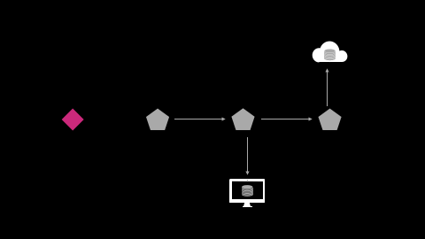

# The Manual

  

## Table Of Contents

1) [Overview](./1-overview.md)
2) [Making Requests](./2-requests.md)

<!--

3) [Making Requests](./3-requests.md)
4) [Key Data Structures](./4-data.md)
5) [Caching](./5-caching.md)
6) [Working with Data in your UI](./6-presentation.md)
7) [Field Schemas](./7-schemas.md)
8) [Request Builders](./8-builders.md)
11) [History & Mission](./11-about.md)

-->
