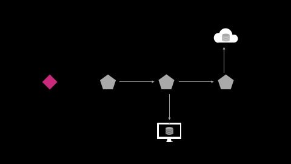
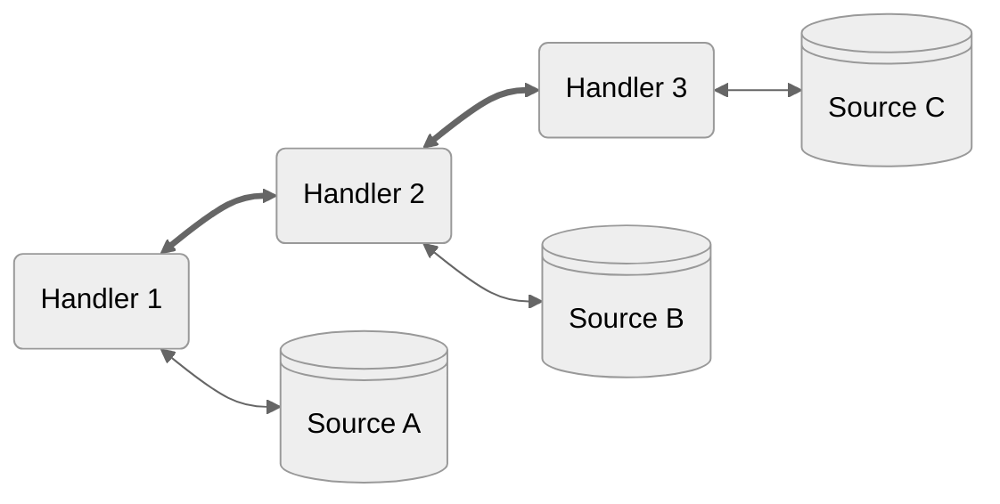

<table>
  <tr>
    <td align="center" width="300">

[← Overview](./1-overview.md)</td>
   <td align="center" width="300">
   
[❖ Table of Contents](./0-index.md)</td>
   <td align="center" width="300">

[Key Data Structures →](./4-data.md)</td>
  </tr>
</table>

## Making Requests

Requests are how your application fetches or updates data stored remotely.

```ts
const { content } = await store.request({
  url: '/api/users'
});
```

### What does remote mean?

Most commonly remote data refers to data that is stored on your server and accessed and updated via your backend API.

But it doesn't have to be! Remote really boils down to [persistence](https://en.wikipedia.org/wiki/Persistence_(computer_science)) - the ability for data to be reliably stored someplace so that it can be found again at a later time.

Common examples of persistent or remote data sources that aren't accessed via connecting to a server are the [File System](https://developer.mozilla.org/en-US/docs/Web/API/File_System_API/Origin_private_file_system), browser managed storage mediums such as [IndexedDB](https://developer.mozilla.org/en-US/docs/Web/API/IndexedDB_API) and [localStorage](https://developer.mozilla.org/en-US/docs/Web/API/Window/localStorage), or [WebAssembly](https://webassembly.org/) builds of [sqlite3](https://sqlite.org/wasm/doc/trunk/index.md).

### Request Options

*Warp***Drive** uses the native [Fetch](https://developer.mozilla.org/en-US/docs/Web/API/Fetch_API) interfaces for [Request](https://developer.mozilla.org/en-US/docs/Web/API/Request) and [Response](https://developer.mozilla.org/en-US/docs/Web/API/Response) as the foundation upon which requests are made. This ensures that if the platform supports it, WarpDrive exposes it: platform APIs are never hidden away.

```ts
const { content } = await store.request({
  url: '/api/users',
  method: 'POST',
  headers: new Headers({
    'Accept': 'application/json',
    'Content-Type': 'application/json',
  }),
  body: JSON.stringify({
    filter: {
      $in: { teams: ['1', '9', '42'] }
    },
    search: { name: 'chris' }
  })
});
```

Of course, writing requests could get repetitive. This is where [builders]() help out. Builders are simple functions that produce the json request object.

```ts
function queryUsers(query) {
  return {
    url: '/api/users',
    method: 'POST',
    headers: new Headers({
      'Accept': 'application/json',
      'Content-Type': 'application/json',
    }),
    body: JSON.stringify(query)
  }
}

const { content } = await store.request(
  queryUsers({
    filter: {
      $in: { teams: ['1', '9', '42'] }
    },
    search: { name: 'chris' }
  })
)
```

Builders make it easy to quickly write shareable, reusable requests with [typed responses]() that mirror your application's capabilities.

### Do requests have to use fetch?

Requests do not need to use fetch! The native [Request](https://developer.mozilla.org/en-US/docs/Web/API/Request) interface provides a convenient, feature-rich way to describe the data you want to retrieve or update – but ultimately request handlers get to decide how that occurs.

Request handlers can be used to connect to any data source via any mechanism. Besides fetch, this might be localStorage, [XMLHttpRequest](https://developer.mozilla.org/en-US/docs/Web/API/XMLHttpRequest), [WebSockets](https://developer.mozilla.org/en-US/docs/Web/API/WebSocket), [ServerEvents](https://developer.mozilla.org/en-US/docs/Web/API/EventSource), [MessageChannel](https://developer.mozilla.org/en-US/docs/Web/API/MessageChannel), or something else entirely!


WarpDrive offers both a typed JS approach to making requests and a declarative component approach.

<p align="center">
  
</p>

<p align="center">
  
</p>

<p align="center">
  
</p>


<br>
<br>
<br>
<br>
<br>
<br>
<br>
<br>
<br>
<br>
<br>
<br>
<br>
<br>
<br>
<br>
<br>
<br>
<br>
<br>
<br>
<br>
<br>
<br>
<br>
<br>
<br>
<br>
<br>
<br>
<br>
<br>
<br>
<br>
<br>
<br>

```ts
const result = await store.request({
  url: '/api/users?search=Chris'
})
```

```glimmer-ts
const UsersSearch = {
  url: '/api/users?search=Chris'
});

export default <template>
  <Request @query={{UsersSearch}}>
    <:content as |result|>
      <ul>
        {{#each result.data as |user|}}
          <li>{{user.name}}</li>
        {{/each}}
      </ul>
    </:content>
  </Request>
</template>
```

Every request three distinct parts

- *the request* - the object we construct to describe what it is we want to do
- *fulfillment* - how we go about making the request do the thing we need it to do
- *the response* - the processed result once the request is complete

### Fetch Example

> [!TIP]
> When we want to show integration with a framework, this tutorial
> uses [EmberJS](https://emberjs.com), a powerful modern web framework with an established multi-decade legacy.

<br>

*Run This Example* → [Request | Fetch Example](https://warpdrive.nullvoxpopuli.com/manual/requests/fetch)

<br>

Data fetching is managed by a `RequestManager`, which executes handlers you provide.

In order to make requests, first we create a `RequestManager` for our
application, and we tell it to fulfill requests using a `Fetch` handler.

```ts
import RequestManager from '@ember-data/request';
import { Fetch } from '@ember-data/request/fetch';

const manager = new RequestManager().use([Fetch]);
```

Now we can issue a request for a list of our users:

```ts
const { content } = await manager.request({ url: '/users' });

for (const user of content.data) {
  greet(`${user.firstName} ${user.lastName}`);
}
```

If we wanted to type the above request, we could supply a type for the
content returned by the request:

```ts
type User = {
  id: string;
  firstName: string;
  lastName: string;
  age: number;
};

type UsersQuery = {
  data: User[];
}
```

And use it like this:

```ts
const { content } = await manager.request<UsersQuery>({ url: '/users' });
```

> [!TIP]
> Manually supplying the generic is NOT the preferred way
> to type a request, look for the section on [builders](./7-builders.md)
> later.

<br>

### The Chain of Responsibility

When we created the request manager for our application above, you may have noticed that when we told it to fulfill requests using the `Fetch` handler we did so by passing in an array:

```ts
new RequestManager().use([Fetch]);
```

The request manager follows the [chain-of-responsibility pattern](https://en.wikipedia.org/wiki/Chain-of-responsibility_pattern): each handler in our array may choose to fulfill the request, modify it, or pass it along unchanged to the next handler in the array, in array order.





A handler receives the request `context` as well as a `next` function with which to pass along
a request if it so chooses.

```ts
type NextFn<T> = (req: RequestInfo) => Future<T>;

type Handler = {
  request<T>(context: RequestContext, next: NextFn<T>): Promise<T> | Future<T>;
}
```

`next` returns a Future, which is a promise with a few additional capabilities. Futures resolve
with the response from the next handler in the chain. This allows a handler to read or modify
the response if it wants.

> [!Important]
> requests are immutable, to modify one the handler must create a new request, copying over or
> cloning the parts it wants to leave unchanged.

```ts
type NextFn<T> = (req: RequestInfo) => Future<T>;

type Handler = {
  request<T>(context: RequestContext, next: NextFn<T>): Promise<T> | Future<T>;
}
```

A handler may be any object with a `request` method. This allows both stateful and non-stateful handlers to be utilized.

> [!TIP]
> Handlers should take care of the most generalizable concerns. In general great handlers
> - apply to many-if-not-all requests
> - have a clear heuristic by which they activate (a header, op-code, option, or url scheme)
> - don't block response streaming (we'll talk about this later)

<br>

<br>

---

<br>

<table>
  <tr>
    <td align="center" width="300">

[← Overview](./1-overview.md)</td>
   <td align="center" width="300">
   
[❖ Table of Contents](./0-index.md)</td>
   <td align="center" width="300">

[Key Data Structures →](./4-data.md)</td>
  </tr>
</table>
