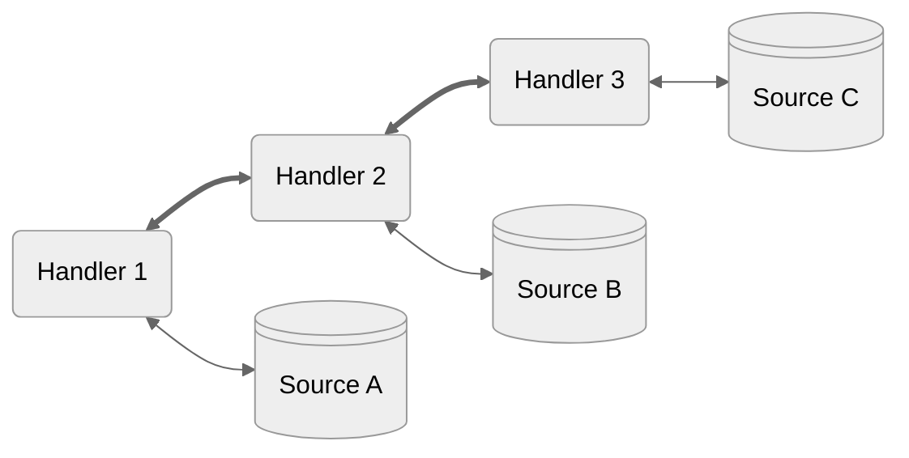

<table>
  <tr>
    <td align="center" width="300">

[← Overview](./2-overview.md)</td>
   <td align="center" width="300">
   
[❖ Table of Contents](./0-index.md)</td>
   <td align="center" width="300">

[Key Data Structures →](./4-data.md)</td>
  </tr>
</table>

## Requests

Requests are how your application fetches data from a source or asks the source to update data to a new state.

*Warp***Drive** uses the native interfaces for [Request](https://developer.mozilla.org/en-US/docs/Web/API/Request) and [Response](https://developer.mozilla.org/en-US/docs/Web/API/Response) as the foundation upon which it layers features for fulfilling requests.

Sources can be anything that has the ability for you to store and retrieve data: for example your API, the file system, or IndexedDB.

Though the actual source and connection type do not matter, in a typical app requests are fulfilled by making [fetch](https://developer.mozilla.org/en-US/docs/Web/API/Fetch_API) calls against server endpoints making up an API.

<br>

### Fetch Example

> [!TIP]
> When we want to show integration with a framework, this tutorial
> uses [EmberJS](https://emberjs.com), a powerful modern web framework with an established multi-decade legacy.

<br>

*Run This Example* → [Request | Fetch Example](https://warpdrive.nullvoxpopuli.com/manual/requests/fetch)

<br>

Data fetching is managed by a `RequestManager`, which executes handlers you provide.

In order to make requests, first we create a `RequestManager` for our
application, and we tell it to fulfill requests using a `Fetch` handler.

```ts
import RequestManager from '@ember-data/request';
import { Fetch } from '@ember-data/request/fetch';

const manager = new RequestManager().use([Fetch]);
```

Now we can issue a request for a list of our users:

```ts
const { content } = await manager.request({ url: '/users' });

for (const user of content.data) {
  greet(`${user.firstName} ${user.lastName}`);
}
```

If we wanted to type the above request, we could supply a type for the
content returned by the request:

```ts
type User = {
  id: string;
  firstName: string;
  lastName: string;
  age: number;
};

type UsersQuery = {
  data: User[];
}
```

And use it like this:

```ts
const { content } = await manager.request<UsersQuery>({ url: '/users' });
```

> [!TIP]
> Manually supplying the generic is NOT the preferred way
> to type a request, look for the section on [builders](./7-builders.md)
> later.

<br>

### The Chain of Responsibility

When we created the request manager for our application above, you may have noticed that when we told it to fulfill requests using the `Fetch` handler we did so by passing in an array:

```ts
new RequestManager().use([Fetch]);
```

The request manager follows the [chain-of-responsibility pattern](https://en.wikipedia.org/wiki/Chain-of-responsibility_pattern): each handler in our array may choose to fulfill the request, modify it, or pass it along unchanged to the next handler in the array, in array order.





A handler receives the request `context` as well as a `next` function with which to pass along
a request if it so chooses.

```ts
type NextFn<T> = (req: RequestInfo) => Future<T>;

type Handler = {
  request<T>(context: RequestContext, next: NextFn<T>): Promise<T> | Future<T>;
}
```

`next` returns a Future, which is a promise with a few additional capabilities. Futures resolve
with the response from the next handler in the chain. This allows a handler to read or modify
the response if it wants.

> [!Important]
> requests are immutable, to modify one the handler must create a new request, copying over or
> cloning the parts it wants to leave unchanged.

```ts
type NextFn<T> = (req: RequestInfo) => Future<T>;

type Handler = {
  request<T>(context: RequestContext, next: NextFn<T>): Promise<T> | Future<T>;
}
```

A handler may be any object with a `request` method. This allows both stateful and non-stateful handlers to be utilized.

> [!TIP]
> Handlers should take care of the most generalizable concerns. In general great handlers
> - apply to many-if-not-all requests
> - have a clear heuristic by which they activate (a header, op-code, option, or url scheme)
> - don't block response streaming (we'll talk about this later)

<br>

<br>

---

<br>

<table>
  <tr>
    <td align="center" width="300">

[← Overview](./2-overview.md)</td>
   <td align="center" width="300">
   
[❖ Table of Contents](./0-index.md)</td>
   <td align="center" width="300">

[Key Data Structures →](./4-data.md)</td>
  </tr>
</table>
