# Relationships Guide

**[Feature Overview](#feature-overview)**
- [Resource Relationships](#resource-relationships)
- [Collection Relationships](#collection-relationships)
- [Inverses](#inverses)
- [Polymorphism](#polymorphism)
- [Links vs Identifiers](#links-vs-identifiers)
- [Sync vs Async](#sync-vs-async)

**[Configuration](#configuration)**
- [1:none](#one-to-none) (One To None)
- [1:1](#one-to-one) (One To One)
- [1:Many](#one-to-many) (One To Many)
- [Many:None](#many-to-none) (Many To None)
- [Many:1](#one-to-many) (Many To One)
- [Many:Many](#many-to-many) (Many To Many)

**[Mutating Relationships](#mutating-relationships)**
- [Adding/Removing]()
- [Saving]()
- [Saving Multiple Related Records At Once]()
- [Sorting & Filtering]()

**[Advanced](#advanced)**
- [Understanding "the Graph"]()
- [Pagination]()
- [Directionality]()
- [Compound Foreign Keys]()
- [Joins]()

---

## Feature Overview

### Resource Relationships

### Collection Relationships

### Inverses

### Polymorphism

### Links vs Identifiers

### Sync vs Async

---

## Configuration

### One To None

Pretend we're building a social network for trail runners 🏃🏃🏾‍♀️, and a TrailRunner (maybe [@runspired](https://github.com/runspired)) can have a favorite Trail to run on . While the TrailRunner has a favorite trail, the trail has no concept of a TrailRunner.

```mermaid
graph LR
  A(🌲 TrailRunner.favoriteTrail) ==> B(⛰️ Trail)
```



#### Using `@ember-data/model`

*TrailRunner*

```ts
import Model, { belongsTo } from '@ember-data/model';

export default class TrailRunner extends Model {
  @belongsTo('trail', { inverse: null, async: false })
  favoriteTrail;
}
```

*Trail*

```ts
import Model, { attr } from '@ember-data/model';

export default class Trail extends Model {
  @attr name;
}
```

#### Using JSON Schemas

**Current**

```json
{
  "kind": "belongsTo",
  "name": "favoriteTrail",
  "options": { "async": false, "inverse": null },
  "type": "trail",
}
```

**🚧 Coming Soon**

Now that we've deprecated implicit option values, we're able to change defaults.
This means that the next iteration of Schema will be able to reliably use the
The lack of an option like "async" or "inverse" as a false-y value.

We also are shifting "kind" from "belongsTo" to "resource" to make it more clear
that relationships do not (by default) have directionality or ownership over their
inverse.

```json
{
  "kind": "resource",
  "name": "favoriteTrail",
  "type": "trail",
}
```

#### Using LegacyCompat Mode for `@warp-drive/schema-record` (🚧 Coming Soon)

*Trail*

```ts
import { attr } from '@warp-drive/schema';

export default class Trail {
  @attr name: string;
}
```

*TrailRunner*

```ts
import { belongsTo } from '@warp-drive/schema';
import Trail from './trail';

export default class TrailRunner {
  @belongsTo(Trail) favoriteTrail;
}
```

#### Using `@warp-drive/schema-record` (🚧 Coming Soon)

*Trail*

```ts
import { field } from '@warp-drive/schema';

export default class Trail {
  @field name: string;
}
```

*TrailRunner*

```ts
import { resource } from '@warp-drive/schema';
import Trail from './trail';

export default class TrailRunner {
  @resource(Trail) favoriteTrail;
}
```

### One To One

### One To Many

### Many To None

### Many to Many

---

## Mutating Relationships

---

## Advanced
