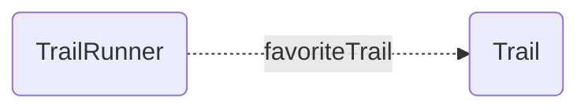

# One To None Relationships

Pretend we're building a social network for trail runners 🏃🏃🏾‍♀️, and a TrailRunner (maybe [@runspired](https://github.com/runspired)) can have a favorite Trail to run on . While the TrailRunner has a favorite trail, the trail has no concept of a TrailRunner.



Such a relationship is singular and unidirectional (it only points to one resource, and only points in one direction).
When a relationship only points in one direction, we say it has no [inverse](../features/inverses.md).

You'll note that effectively this setup implicitly indicates a "many" relationship. A Trail "implicitly" has many runners (for whom it is their favorite trail).

Internally, EmberData will keep track of this implicit relationship such that if the trail were to be destroyed in a landslide its deletion would result in removing it as the favoriteTrail for each associated runner.

Implicit relationships are not available as a public API, because they represent a highly incomplete view of the data, but the book-keeping produces benefits such as
the ability to efficiently disassociate the record from relationships when it is destroyed.

Here's how we can define such a relationship via various mechanisms.

- [Using @ember-data/model](#using-ember-datamodel)
- [Using json schemas](#using-json-schemas)
- [🚧 Using @warp-drive/schema-record](#using-warp-driveschema-record-🚧-coming-soon)
  - [Legacy Compat Mode](#legacycompat-mode)

---

## Using `@ember-data/model`

> **Note** Models are currently the primary way that users of EmberData define "schema".
>
> Models are not the only way to define schema today, but they
> are the most immediately available ergonomic way to do so.

When using Models, EmberData parses schema from them at runtime,
converting static information defined on the class into the json
schema format needed by the rest of the system.

This is handled by the implementation of the [schema service](https://api.emberjs.com/ember-data/release/classes/SchemaService) provided
by the `@ember-data/model` package. The service converts the class
definitions into the json definitions described in the next section.

⛰️ *Trail*

```ts
import Model, { attr } from '@ember-data/model';

export default class Trail extends Model {
  @attr name;
}
```

🌲 *TrailRunner*

```ts
import Model, { belongsTo } from '@ember-data/model';

export default class TrailRunner extends Model {
  @belongsTo('trail', { inverse: null, async: false })
  favoriteTrail;
}
```

---

## Using JSON Schemas

EmberData doesn't care where your schemas come from, how they are authored,
or how you load them into the system so long as when it asks the [schema service](https://api.emberjs.com/ember-data/release/classes/SchemaService)
for information it gets back field definitions in the right json shape.

Here, we show how the above trail runner relationship is described by a field definition.

**Current**

```json
{
  "kind": "belongsTo",
  "name": "favoriteTrail",
  "options": { "async": false, "inverse": null },
  "type": "trail",
}
```

**🚧 Coming Soon**

Because we deprecated implicit option values in 4.x, we are now able to change defaults.

This means that the next iteration of Schema will be able to reliably use
the The lack of an option like "async" or "inverse" as a false-y value.

We also are shifting the value for "kind" from "belongsTo" to "resource"
to make it more readil clear that relationships do not (by default) have
directionality or ownership over their inverse.

```json
{
  "kind": "resource",
  "name": "favoriteTrail",
  "type": "trail",
}
```

---

## Using `@warp-drive/schema-record` (🚧 Coming Soon)

Working with schemas in a raw json format is far more flexible, lightweight and
performant than working with bulky classes that need to be shipped across the wire,parsed, and instantiated. Even relatively small apps can quickly find themselves shipping large quantities of JS just to describe their data.

No one wants to author schemas in raw JSON though (we hope 😬), and the ergonomics of typed data and editor autocomplete based on your schemas are vital to productivity and
code quality. For this, we offer a way to express schemas as typescript using types, classes and decorators which are then compiled into json schemas and typescript interfaces for use by your project.

⛰️ *Trail*

```ts
import { field } from '@warp-drive/schema';

export class Trail {
  @field name: string;
}
```

🌲 *TrailRunner*

```ts
import { resource } from '@warp-drive/schema';
import { Trail } from './trail';

export class TrailRunner {
  @resource(Trail) favoriteTrail;
}
```

### LegacyCompat Mode

Support for migrating from `@ember-data/model` on a more granular basis is provided by decorators that preserve the semantics of the quirks of that class. This allows you to begin eliminating models
and adopting other features of schemas sooner.

⛰️ *Trail*

```ts
import { attr } from '@warp-drive/schema/legacy';

export default class Trail {
  @attr name: string;
}
```

🌲 *TrailRunner*

```ts
import { belongsTo } from '@warp-drive/schema/legacy';
import Trail from './trail';

export default class TrailRunner {
  @belongsTo(Trail) favoriteTrail;
}
```
