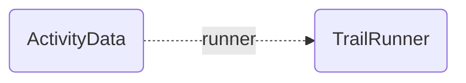
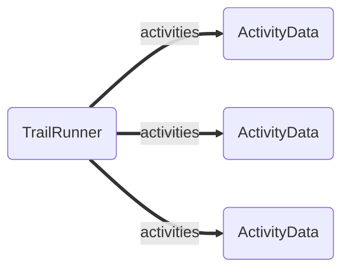
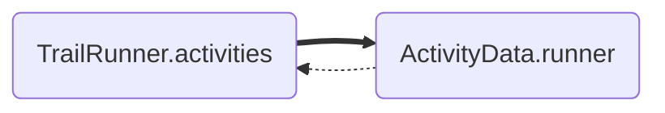
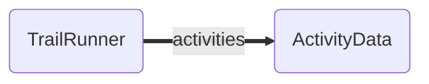
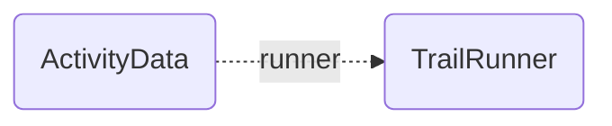

# One To Many Relationships

- Previous ← [One To One Relationships](./1-one-to-one.md)
- Next → [Many To None Relationships](./3-many-to-none.md)
- ⮐ [Relationships Guide](../../relationships.md)

---

Imagine our social network for trail runners 🏃🏃🏾‍♀️ allows runners to upload their runs as activities.

In this model, the ActivityData only pertains on one TrailRunner



While the Trail Runner has many such activies.



> **Note** In our charts we use dotted lines for singular relationships and thick solid lines for collection relationships.

Let's workout!

There are two ways we can model this relationship: bidirectionally with managed [inverses](../features/inverses.md), or unidirectionally without managed inverses.

In the bidirectional configuration, changes to one side of the relationship change the other side as well. This includes
both updates from remote state (a payload for the resource received from the API) as well as mutations to the local state
(application code setting a new, unsaved value for the relationship).



In the unidirectional configuration, we effectively have two separate distinct relationships.

A [many-to-none](./4-many-to-none.md) relationship from TrailRunner to ActivityData.



And a [one-to-none](./0-one-to-none.md) relationship from ActivityData to TrailRunner.



With distinct relationships, we may edit one side without affecting the state of the inverse. This is particularly useful
in two situations.

First, it may be the case that the user has thousands or tens of thousands of activities. In this case, you likely don't want whichever individual activities you happen to load to create an incomplete list of the TrailRunner's activities. It's better to load and work with the activities list in isolation, ideally in a paginated manner.

Second, it may be the case that runner is able to share the activity data with another runner that forgot to record. By not coupling the relationship, the ActivityData can still be owned by the first runner by included in the second runner's list of activities as well.

Head over to [many-to-none](./4-many-to-none.md) and [one-to-none](./0-one-to-none.md) if this is the setup that is best for you. Else, here's how we can define such a relationship via various mechanisms.

- [Using @ember-data/model](#using-ember-datamodel)
- [Using json schemas](#using-json-schemas)
- [🚧 Using @warp-drive/schema-record](#using-warp-driveschema-record-🚧-coming-soon)
  - [Legacy Compat Mode](#legacycompat-mode)

---

## Using `@ember-data/model`

> **Note** Models are currently the primary way that users of EmberData define "schema".
>
> Models are not the only way to define schema today, but they
> are the most immediately available ergonomic way to do so.

When using Models, EmberData parses schema from them at runtime,
converting static information defined on the class into the json
schema format needed by the rest of the system.

This is handled by the implementation of the [schema service](https://api.emberjs.com/ember-data/release/classes/SchemaService) provided
by the `@ember-data/model` package. The service converts the class
definitions into the json definitions described in the next section.

🏃🏾‍♀️ *ActivityData*

```ts
import Model, { belongsTo } from '@ember-data/model';

export default class ActivityData extends Model {
  @belongsTo('trail-runner', { inverse: 'activities', async: false })
  runner;
}
```

🌲 *TrailRunner*

```ts
import Model, { hasMany } from '@ember-data/model';

export default class TrailRunner extends Model {
  @hasMany('activity-data', { inverse: 'runner', async: false })
  activities;
}
```

---

## Using JSON Schemas

EmberData doesn't care where your schemas come from, how they are authored,
or how you load them into the system so long as when it asks the [schema service](https://api.emberjs.com/ember-data/release/classes/SchemaService)
for information it gets back field definitions in the right json shape.

Here, we show how the above trail runner relationship is described by a field definition.

**Current**

🏃🏾‍♀️ *ActivityData*

```json
{
  "kind": "belongsTo",
  "name": "runner",
  "options": { "async": false, "inverse": "activities" },
  "type": "trail-runner",
}
```

🌲 *TrailRunner*

```json
{
  "kind": "hasMany",
  "name": "activities",
  "options": { "async": false, "inverse": "runner" },
  "type": "activity-data",
}
```

**🚧 Coming Soon**

Because we deprecated implicit option values in 4.x, we are now able to change defaults.

This means that the next iteration of Schema will be able to reliably use
the The lack of an option like "async" or "inverse" as a false-y value.

We also are shifting the value for "kind" from "belongsTo" to "resource"
to make it more readil clear that relationships do not (by default) have
directionality or ownership over their inverse.

🏃🏾‍♀️ *ActivityData*

```json
{
  "kind": "resource",
  "name": "runner",
  "options": { "inverse": "activities" },
  "type": "trail-runner",
}
```

🌲 *TrailRunner*

```json
{
  "kind": "collection",
  "name": "activities",
  "options": { "inverse": "runner" },
  "type": "activity-data",
}
```

---

## Using `@warp-drive/schema-record` (🚧 Coming Soon)

Working with schemas in a raw json format is far more flexible, lightweight and
performant than working with bulky classes that need to be shipped across the wire,parsed, and instantiated. Even relatively small apps can quickly find themselves shipping large quantities of JS just to describe their data.

No one wants to author schemas in raw JSON though (we hope 😬), and the ergonomics of typed data and editor autocomplete based on your schemas are vital to productivity and
code quality. For this, we offer a way to express schemas as typescript using types, classes and decorators which are then compiled into json schemas and typescript interfaces for use by your project.

🏃🏾‍♀️ *ActivityData*

```ts
import { resource } from '@warp-drive/schema';
import { TrailRunner } from './trail-runner';

export class ActivityData {
  @resource(TrailRunner, { inverse: "activities" })
  runner;
}
```

🌲 *TrailRunner*

```ts
import { collection } from '@warp-drive/schema';
import { ActivityData } from './activity-data';

export class TrailRunner {
  @collection(ActivityData, { inverse: "runner" })
  activities;
}
```

### LegacyCompat Mode

Support for migrating from `@ember-data/model` on a more granular basis is provided by decorators that preserve the semantics of the quirks of that class. This allows you to begin eliminating models
and adopting other features of schemas sooner.

🏃🏾‍♀️ *ActivityData*

```ts
import { belongsTo } from '@warp-drive/schema/legacy';
import { TrailRunner } from './trail-runner';

export class ActivityData {
  @belongsTo(TrailRunner, { inverse: "activities" })
  runner;
}
```

🌲 *TrailRunner*

```ts
import { hasMany } from '@warp-drive/schema/legacy';
import { ActivityData } from './activity-data';

export class TrailRunner {
  @hasMany(ActivityData, { inverse: "runner" })
  activities;
}
```

---

- Previous ← [One To One Relationships](./1-one-to-one.md)
- Next → [Many To None Relationships](./3-many-to-none.md)
- ⮐ [Relationships Guide](../../relationships.md)
