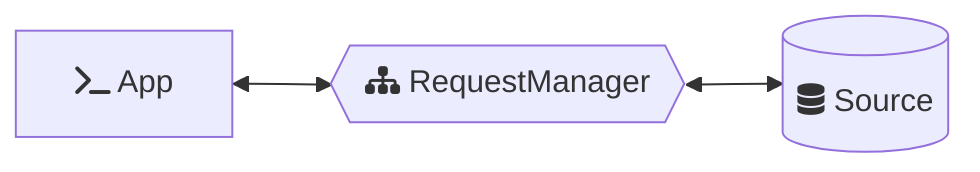
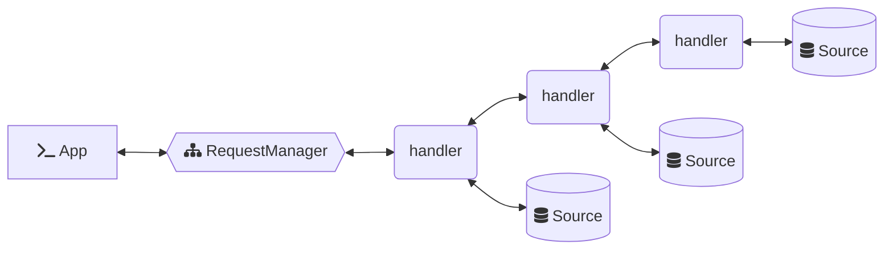
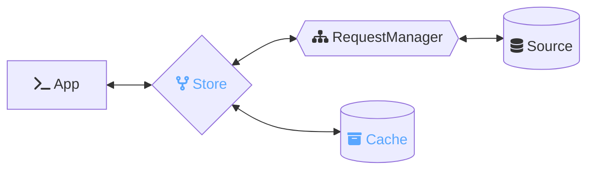
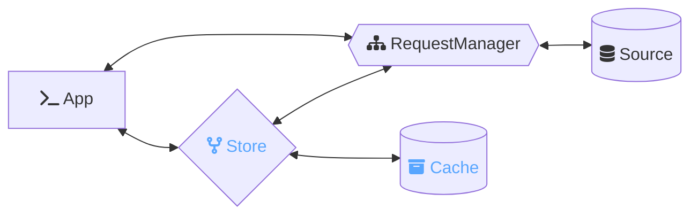

# Request Guide | Overview

- Previous ← Intro: [What Is a Request?](./0-intro.md)
- Next → [?](./2-.md)
- ⮐ [Requests Guide](../index.md)

---

## Request Management

A `RequestManager` receives a request and manages fulfillment via configured handlers. It may be used standalone from the rest of *Ember***Data** and is not specific to any library or framework.

Each handler may choose to fulfill the request using some source of data or to pass the request along to other handlers.

The same or a separate instance of a `RequestManager` may also be used to fulfill requests issued by [*Ember***Data**{Store}](https://github.com/emberjs/data/tree/main/packages/store)

When the same instance is used by both this allows for simple coordination throughout the application. Requests issued by the Store will use the in-memory cache
and return hydrated responses, requests issued directly to the RequestManager
will skip the in-memory cache and return raw responses.

---

- Previous ← [One To None Relationships](./0-one-to-none.md)
- Next → [?](./2-.md)
- ⮐ [Requests Guide](../index.md)
