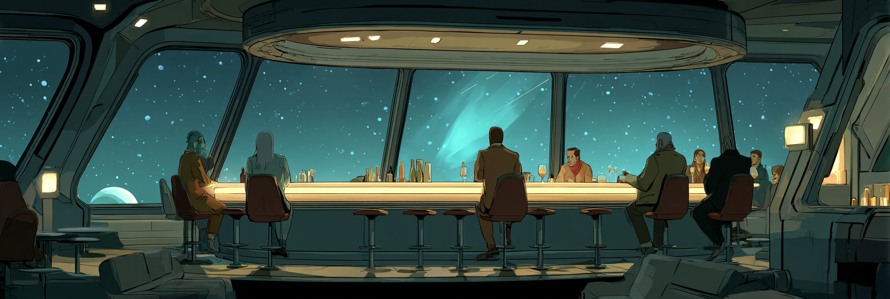

# Community Resources

Wrote a blog post? Gave a talk? Published a book? Went on a podcast? Something else fellow explorers might need? We love it all!

Please feel free to PR anything ***Warp*Drive** related to this list that others might find useful

## 2025

### Conference Talks

[EmberFest 2025 (Happening Soon)](https://emberfest.eu/)

- EmberFest 2025 | A Practical Intro to ReactiveResources & Schema‑Driven Data Handling - Mehul Chaudhari
- EmberFest 2025 | WarpDrive: Set Data to Stun - by Krystan HuffMenne
- EmberFest 2025 | WarpDrive Workshop - by [Chris Thoburn](https://github.com/runspired)
- EmberFest 2025 | WarpDrive | The Making of a Polaris Application - by [Chris Thoburn](https://github.com/runspired)
- EmberFest 2025 | Multi-framework mashup - making other frameworks work in Ember - by Nick Schot

### Blog Posts

- [Exploring Transformed and Derived Values in @warp-drive/schema-record](https://runspired.com/2025/02/06/exploring-transformed-and-derivied-values-in-schema-record.html) | *2025-02-06* by [Chris Thoburn](https://github.com/runspired)

## 2024

### Conference Talks

- EmberFest 2024 | [The Architecture of WarpDrive | Beyond Universal – Chris Thoburn](https://www.youtube.com/watch?v=BCv8OgcG5vM)
- EmberConf 2024 | [An Important EmberData Project Update with Chris Thoburn and Krystan HuffMenne](https://www.youtube.com/watch?v=HQiKFaTAahM)
- EmberConf 2024 | [The EmberData Upgrade Path with Kirill Shaplyko](https://www.youtube.com/watch?v=3_kTmfLG6b0)

### Blog Posts

- [Adventures in WarpDrive | Cascade On Delete](https://runspired.com/2024/11/29/cascade-on-delete.html) | *2024-11-29* by [Chris Thoburn](https://github.com/runspired)
- [Not Your Parent's EmberData](https://runspired.com/2024/01/31/modern-ember-data.html) | *2024-01-31* by [Chris Thoburn](https://github.com/runspired)

## 2023

### Conference Talks

- EmberFest 2023 | [The New Era of Backend Integration – Kirill Shaplyko](https://www.youtube.com/watch?v=PKekDnJxUQY)
- EmberConf 2023 | [EmberData: Data Management That Scales With You by Chris Thoburn](https://www.youtube.com/watch?v=KpakmlxvT0s)

### Blog Posts

- [Exploring Transformed and Derived Values in @warp-drive/schema-record](https://runspired.com/2025/02/06/exploring-transformed-and-derivied-values-in-schema-record.html) | *2025-02-06* by [Chris Thoburn](https://github.com/runspired)
- [Adventures in WarpDrive | Cascade On Delete](https://runspired.com/2024/11/29/cascade-on-delete.html) | *2024-11-29* by [Chris Thoburn](https://github.com/runspired)
- [Not Your Parent's EmberData](https://runspired.com/2024/01/31/modern-ember-data.html) | *2024-01-31* by [Chris Thoburn](https://github.com/runspired)

### Podcasts

- **2023-09-21** Whiskey Web & Whatnot | [109: Hot Takes, Ember Data, and Open Source with Chris Thoburn (Runspired)](https://whiskey.fm/hot-takes-ember-data-and-open-source-with-chris-thoburn-runspired)

## 2022

### Podcasts

- **2022-01-27** Whiskey Web & Whatnot | [20: Discovering Ember, Adopting Orbit, and Unlocking Optimization with Chris Thoburn (runspired)](https://whiskey.fm/discovering-ember-adopting-orbit-and-unlocking-optimization-with-chris-thoburn-runspired)

## 2019

### Conference Talks

- EmberFest 2019 | [Ember Data 2019](https://www.youtube.com/watch?v=zbqbsOyLM30)
