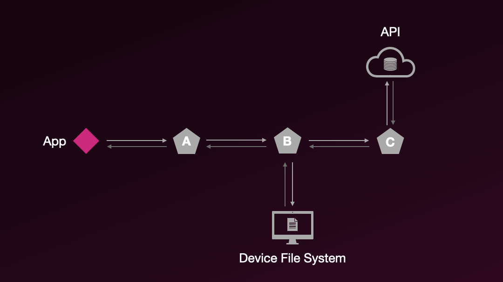
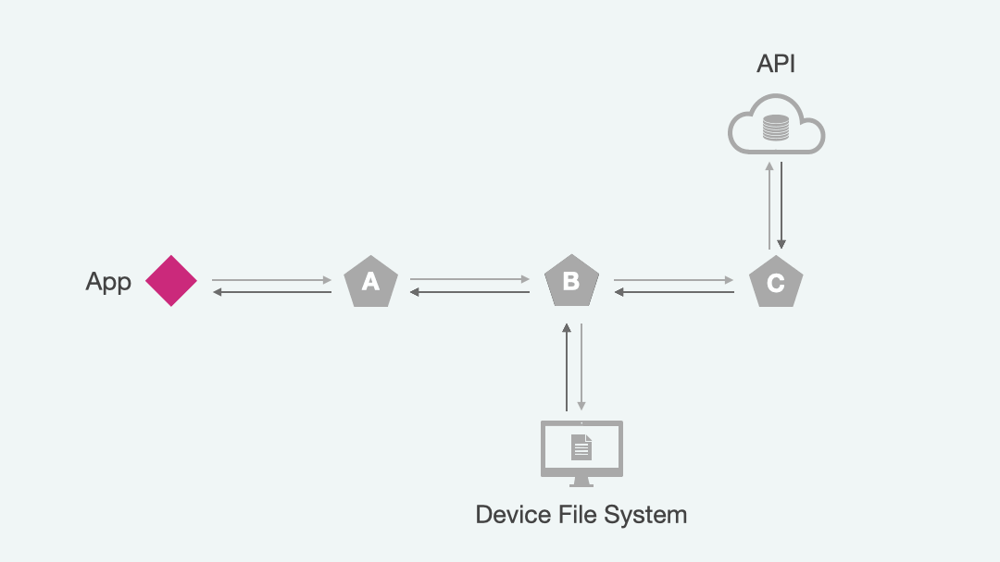

# Making Requests

Requests are how your application fetches or updates data stored remotely.

***What Does Remote Mean?***

Most commonly remote data refers to data that is stored on your server and accessed and updated via your backend API.

But it doesn't have to be! Remote really boils down to [persistence](https://en.wikipedia.org/wiki/Persistence_(computer_science)) - the ability for data to be reliably stored and retrieved again at a later time.

<br>


## Reactive Control Flow

*Warp***Drive** offers both a JavaScript API and a Component API for working with
requests. Both APIs offer a clean way of working with asynchronous data via reactive
values and states instead of needing to switch into imperative code or async/await. This
approach enables enables automatic cleanup when components dismount, unlocking [Intelligent Lifecycle Management]()

:::tabs

== Component API

With the component API, any builder function can be used to produce the query
the `<Request />` component should make.

::: code-group

```glimmer-ts [Ember]
import { Request } from '@warp-drive/ember';
import { findRecord } from '@warp-drive/utilities/json-api';
import { Spinner } from './spinner';

export default <template>
  <Request @query={{findRecord "user" @userId}}> <!-- [!code focus] -->
    <:content as |result|>  <!-- [!code focus] -->
      Hello {{result.data.name}}!
    </:content> <!-- [!code focus] -->
  </Request> <!-- [!code focus] -->
</template>
```

```.vue [Vue]
Coming Soon!
```

```.svelte [Svelte]
Coming Soon!
```

== JS API

With the JS API, getters and methods can declaratively compute off of
the state of the request.

::: code-group

```glimmer-ts [Ember]
import Component from '@glimmer/component';
import { cached } from '@glimmer/tracking';
import { service } from '@ember/service';

import { getRequestState } from '@warp-drive/ember'; // [!code focus]
import { findRecord } from '@warp-drive/utilities/json-api';

import type Store from '#/services/store.ts';

export default class Example extends Component { // [!code focus]
  @service declare store: Store;

  @cached
  get userRequest() {
    return this.store.request( // [!code focus:3]
      findRecord("user", this.args.userId)
    );
  }

  get user() {
    return getRequestState(this.userRequest).value?.data; // [!code focus]
  }

  <template>
    {{#if this.user}}
        Hello {{this.user.name}}! <!-- [!code focus] -->
    {{/if}}
  </template>
} // [!code focus]
```

```.vue [Vue]
Coming Soon!
```

```.svelte [Svelte]
Coming Soon!
```

== Combined

The Component API and the JS API interop seamlessly. Requests
triggered by the JS API can be passed into the `<Request />` component
as args.

::: code-group

```glimmer-ts [Ember]
import Component from '@glimmer/component';
import { cached } from '@glimmer/tracking';
import { service } from '@ember/service';

import { Request } from '@warp-drive/ember'; // [!code focus]
import { findRecord } from '@warp-drive/utilities/json-api';

import type Store from '#/services/store.ts';

export default class Example extends Component { // [!code focus]
  @service declare store: Store;

  @cached
  get userRequest() { // [!code focus:5]
    return this.store.request( 
      findRecord("user", this.args.userId)
    );
  }

  <template>
    <Request @request={{this.userRequest}}> <!-- [!code focus] -->
      <:content as |result|>  <!-- [!code focus] -->
        Hello {{result.data.name}}!
      </:content> <!-- [!code focus] -->
    </Request> <!-- [!code focus] -->
  </template>
}
```

```.vue [Vue]
Coming Soon!
```

```.svelte [Svelte]
Coming Soon!
```

:::

## Request Options

*Warp***Drive** uses the native [Fetch](https://developer.mozilla.org/en-US/docs/Web/API/Fetch_API) interface for [Request](https://developer.mozilla.org/en-US/docs/Web/API/Request) as the foundation upon which requests are made. This ensures that if the platform supports it, *Warp***Drive** exposes it: platform APIs are never hidden away.

:::tabs key:req1

== Simple GET

```ts [GET /api/users]
const { content } = await store.request({
  url: '/api/users'
});
```

== QUERY with POST

```ts [POST /api/users]
const { content } = await store.request({
  url: '/api/users',
  method: 'POST',
  headers: new Headers({
    'Accept': 'application/json',
    'Content-Type': 'application/json',
  }),
  body: JSON.stringify({
    filter: {
      $in: { teams: ['1', '9', '42'] }
    },
    search: { name: 'chris' }
  })
});
```

== RPC Style Update

```ts [POST /actions/like]
const { content } = await store.request({
  url: '/actions/like',
  method: 'POST',
  headers: new Headers({
    'Accept': 'application/json',
    'Content-Type': 'application/json',
  }),
  body: JSON.stringify({
    actor: { type: 'user', id: '1' },
    content: { type: 'comment', id: '42' }
  })
});
```

:::

Of course, writing requests so manually quickly gets repetitive.

*Warp***Drive** offers two abstractions for helping to write organized, reusable requests.

- [Builders](./builders.md) - simple functions that produce a json request object
- [Handlers](./handlers.md) - middleware that enable enhancing, modifying, or responding to requests

Here's an example of how the requests above could be expressed as builders:

:::tabs key:req1

== Simple GET

```ts [builders/get-users.ts]
export function getUsers() {
  return {
    url: '/api/users'
  }
}
```

```ts [my-app.ts]
import { getUsers } from '#/builders/get-users.ts';

const { content } = await store.request(getUsers());
```

== QUERY with POST

```ts [builders/query-users.ts]
export function queryUsers(query) {
  return {
    url: '/api/users',
    method: 'POST',
    headers: new Headers({
      'Accept': 'application/json',
      'Content-Type': 'application/json',
    }),
    body: JSON.stringify(query)
  }
}
```

```ts [my-app.ts]
import { queryUsers } from '#/builders/query-users.ts';

const { content } = await store.request(
  queryUsers({
    filter: {
      $in: { teams: ['1', '9', '42'] }
    },
    search: { name: 'chris' }
  })
)
```

== RPC Style Update

```ts [builders/create-content-like.ts]
export function createContentLike(actor, content) {
  return {
    url: '/actions/like',
    method: 'POST',
    headers: new Headers({
      'Accept': 'application/json',
      'Content-Type': 'application/json',
    }),
    body: JSON.stringify({
      actor,
      content
    })
  }
}
```

```ts [my-app.ts]
import { createContentLike } from '#/builders/create-content-like.ts';

const { content } = await store.request(createContentLike({
  actor: { type: 'user', id: '1' },
  content: { type: 'comment', id: '42' }
}));
```

:::

Builders make it easy to quickly write shareable, reusable requests with [typed responses](./typing-requests.md) that mirror your application's capabilities and critical business logic.

We build on this foundation to give access to a powerful pipeline for managing requests.

## Requests Do Not Need To Use Fetch

The native [Request](https://developer.mozilla.org/en-US/docs/Web/API/Request) interface provides a convenient, feature-rich way to describe the data you want to retrieve or update – but ultimately request handlers get to decide how that occurs.

Request handlers can be used to connect to any data source via any mechanism. Besides fetch, this might be localStorage, [XMLHttpRequest](https://developer.mozilla.org/en-US/docs/Web/API/XMLHttpRequest), [WebSockets](https://developer.mozilla.org/en-US/docs/Web/API/WebSocket), [ServerEvents](https://developer.mozilla.org/en-US/docs/Web/API/EventSource), [MessageChannel](https://developer.mozilla.org/en-US/docs/Web/API/MessageChannel), or something else entirely!

```ts [services/store.ts]
import Store from '@ember-data/store';

import RequestManager from '@ember-data/request';
import Fetch from '@ember-data/request/fetch';
import { // [!code focus:4] [!code ++]
  SessionSettingsHandler, // [!code ++]
  FileSystemHandler // [!code ++]
} from './app/handlers';  // [!code ++]

export default class AppStore extends Store {

  requestManager = new RequestManager()
    .use([  // [!code focus:5]
      SessionSettingsHandler, // [!code ++]
      FileSystemHandler, // [!code ++]
      Fetch
    ]);

}
```

## Requests Aren't Just For APIs

Requests are a manner of expressing what data you want to use or an update to data you want to make. 

The [File System](https://developer.mozilla.org/en-US/docs/Web/API/File_System_API/Origin_private_file_system), browser managed storage mediums such as [IndexedDB](https://developer.mozilla.org/en-US/docs/Web/API/IndexedDB_API) and [localStorage](https://developer.mozilla.org/en-US/docs/Web/API/Window/localStorage), or [WebAssembly](https://webassembly.org/) builds of [sqlite3](https://sqlite.org/wasm/doc/trunk/index.md) are all common examples of persistent or remote data sources that aren't accessed via connecting to a server.

### The Chain of Responsibility

When we configured the `RequestManager` above, you may have noticed that when we gave it an array of handlers with which to respond to requests.

`RequestManager` follows the [chain-of-responsibility pattern](https://en.wikipedia.org/wiki/Chain-of-responsibility_pattern): each handler in our array may choose to respond to the request, modify it, or pass it along unchanged to the next handler in the array, in array order.




This architecture allows us to quickly integrate any kind of pre- or post- processing for requests to ensure we get the data we want how we want it.

*Warp***Drive** comes with a number of useful composable handlers pre-built:

- [Fetch](/api/@warp-drive/core/variables/Fetch) - it makes `fetch` happen, and more
- [AutoCompress](/api/@warp-drive/utilities/handlers/classes/AutoCompress) - automatically compress large request bodies and use streaming uploads where supported
- [Gate](/api/@warp-drive/utilities/handlers/classes/Gate) - quickly activate/deactivate a handler per-request or more broadly

As well as a suite of useful [utilities](http://localhost:5173/api/@warp-drive/utilities/handlers/) for handlers.
