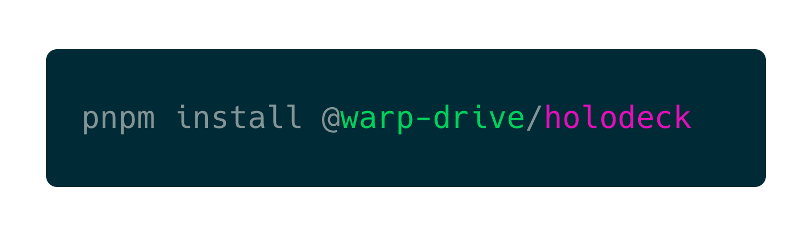

<p align="center">
  
  
</p>

<h3 align="center">⚡️ Simple, Fast HTTP Mocking</h3>
<p align="center">Ideal for Test Suites</p>

<p align="center">
    
</p>


- ⚡️ Real network requests
  - brotli compression
  - http/2
  - no CORS preflight requests
- 💜 Unparalleled DX
  - debug real network requests
  - every request is scoped to a test
  - run as many tests as desired simultaneously
- 🔥 Blazing Fast Tests
  - record your tests when you change them
  - replays from cache until you change them again
  - zero-work: setup work is skipped when in replay mode

## Installation


```json
pnpm install @warp-drive/holodeck
```

**Tagged Releases**

- 
- 
- 
- 
- 


## Usage
#### Mocking from Within a Test

```ts
import { GET } from '@warp-drive/holodeck/mock';

await GET(context, 'users/1', () => ({
  data: {
    id: '1',
    type: 'user',
    attributes: {
      name: 'Chris Thoburn',
    },
  },

// set RECORD to false or remove
// the options hash entirely once the request
// has been recorded
}), { RECORD: true });
```

## Motivations

Comprehensive DX around data management should extend to testing.

### ✨ Amazing Developer Experience

EmberData already understands your data schemas. Building a mocking utility with tight integration into your data usage patterns could bring enormous DX and test suite performance benefits.

Building a real mock server instead of intercepting requests in the browser or via ServiceWorker gives us out-of-the-box DX, better tunability, and greater ability to optimize test suite performance. Speed is the ultimate DX.

### 🔥 Blazing Fast Tests

We've noticed test suites spending an enormous amount of time creating and tearing down mock state in between tests. To combat this, we want to provide
an approach built over `http/3` (`http/2` for now) utilizing aggressive caching
and `brotli` minification in a way that can be replayed over and over again.

Basically, pay the cost when you write the test. Forever after skip the cost until you need to edit the test again.

## Setup

### Use with WarpDrive

First, you will need to add the holodeck handler to the request manager chain prior to `Fetch` (or any equivalent handler that proceeds to network).

For instance:

```ts
import RequestManager from '@ember-data/request';
import Fetch from '@ember-data/request/fetch';
import { MockServerHandler } from '@warp-drive/holodeck';

const manager = new RequestManager();
manager.use([new MockServerHandler(testContext), Fetch]);
```

From within a test this might look like:

```ts
import RequestManager from '@ember-data/request';
import Fetch from '@ember-data/request/fetch';
import { MockServerHandler } from '@warp-drive/holodeck';
import { module, test } from 'qunit';

module('my module', function() {
  test('my test', async function() {
    const manager = new RequestManager();
    manager.use([new MockServerHandler(this), Fetch]);
  });
});
```

Next, you will need to configure holodeck to understand your tests contexts. For qunit and diagnostic
in a project using Ember this is typically done in `tests/test-helper.js`

#### With Diagnostic

```ts
import { setupGlobalHooks } from '@warp-drive/diagnostic';
import { setConfig, setTestId } from '@warp-drive/holodeck';

// if not proxying the port / set port to the correct value here
const MockHost = `https://${window.location.hostname}:${Number(window.location.port) + 1}`;

setConfig({ host: MockHost });

setupGlobalHooks((hooks) => {
  hooks.beforeEach(function (assert) {
    setTestId(this, assert.test.testId);
  });
  hooks.afterEach(function () {
    setTestId(this, null);
  });
});
```

#### With QUnit

```ts
import * as QUnit from 'qunit';
import { setConfig, setTestId } from '@warp-drive/holodeck';

// if not proxying the port / set port to the correct value here
const MockHost = `https://${window.location.hostname}:${Number(window.location.port) + 1}`;

setConfig({ host: MockHost });

QUnit.hooks.beforeEach(function (assert) {
  setTestId(assert.test.testId);
});
QUnit.hooks.afterEach(function (assert) {
  setTestId(null);
});
```

### Testem

You can integrate holodeck with Testem using testem's [async config capability](https://github.com/testem/testem/blob/master/docs/config_file.md#returning-a-promise-from-testemjs):

```ts
module.exports = async function () {
  const holodeck = (await import('@warp-drive/holodeck')).default;
  await holodeck.launchProgram({
    port: 7373,
  });

  process.on('beforeExit', async () => {
    await holodeck.endProgram();
  });

  return {
    // ... testem config
  };
};
```

If you need the API mock to run on the same port as the test suite, you can use Testem's [API Proxy](https://github.com/testem/testem/tree/master?tab=readme-ov-file#api-proxy)

```ts
module.exports = async function () {
  const holodeck = (await import('@warp-drive/holodeck')).default;
  await holodeck.launchProgram({
    port: 7373,
  });

  process.on('beforeExit', async () => {
    await holodeck.endProgram();
  });

  return {
    "proxies": {
      "/api": {
        // holodeck always runs on https
        // the proxy is transparent so this means /api/v1 will route to https://localhost:7373/api/v1
        "target": "https://localhost:7373",
        // "onlyContentTypes": ["xml", "json"],
        // if test suite is on http, set this to false
        // "secure": false,
      },
    }
  };
};
```

### Diagnostic

holodeck can be launched and cleaned up using the lifecycle hooks in the launch config
for diagnostic in `diagnostic.js`:

```ts
import launch from '@warp-drive/diagnostic/server/default-setup.js';
import holodeck from '@warp-drive/holodeck';

await launch({
  async setup(options) {
    await holodeck.launchProgram({
      port: options.port + 1,
    });
  },
  async cleanup() {
    await holodeck.endProgram();
  },
});
```

### ♥️ Credits

 <details>
   <summary>Brought to you with ♥️ love by <a href="https://emberjs.com" title="EmberJS">🐹 Ember</a></summary>

  <style type="text/css">
    img.project-logo {
       padding: 0 5em 1em 5em;
       width: 100px;
       border-bottom: 2px solid #0969da;
       margin: 0 auto;
       display: block;
     }
    details > summary {
      font-size: 1.1rem;
      line-height: 1rem;
      margin-bottom: 1rem;
    }
    details {
      font-size: 1rem;
    }
    details > summary strong {
      display: inline-block;
      padding: .2rem 0;
      color: #000;
      border-bottom: 3px solid #0969da;
    }

    details > details {
      margin-left: 2rem;
    }
    details > details > summary {
      font-size: 1rem;
      line-height: 1rem;
      margin-bottom: 1rem;
    }
    details > details > summary strong {
      display: inline-block;
      padding: .2rem 0;
      color: #555;
      border-bottom: 2px solid #555;
    }
    details > details {
      font-size: .85rem;
    }

    @media (prefers-color-scheme: dark) {
      details > summary strong {
        color: #fff;
      }
    }
    @media (prefers-color-scheme: dark) {
      details > details > summary strong {
        color: #afaba0;
      border-bottom: 2px solid #afaba0;
      }
    }
  </style>
</details>
