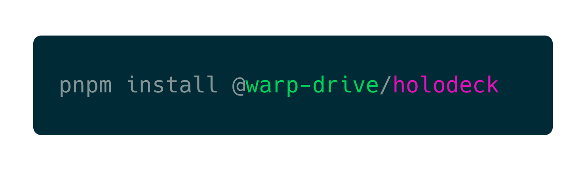

<p align="center">
  
  
</p>

<h3 align="center">⚡️ Simple, Fast HTTP Mocking</h3>
<p align="center">Ideal for Test Suites</p>

<p align="center">
    
</p>

## Installation

> ⚠️ Private

This package may currently only be used within EmberData. A public version is coming soon 💜

```json
"devDependencies": {
  "@warp-drive/holodeck": "workspace:*"
}
```

## Motivations

Comprehensive DX around data management should extend to testing.

### ✨ Amazing Developer Experience

EmberData already understands your data schemas. Building a mocking utility with tight integration into your data usage patterns could bring enormous DX and test suite performance benefits.

Building a real mock server instead of intercepting requests in the browser or via ServiceWorker gives us out-of-the-box DX, better tunability, and greater ability to optimize test suite performance. Speed is the ultimate DX.

### 🔥 Blazing Fast Tests

We've noticed test suites spending an enormous amount of time creating and tearing down mock state in between tests. To combat this, we want to provide
an approach built over `http/3` (`http/2` for now) utilizing aggressive caching
and `brotli` minification in a way that can be replayed over and over again.

Basically, pay the cost when you write the test. Forever after skip the cost until you need to edit the test again.

### ♥️ Credits

 <details>
   <summary>Brought to you with ♥️ love by <a href="https://emberjs.com" title="EmberJS">🐹 Ember</a></summary>

  <style type="text/css">
    img.project-logo {
       padding: 0 5em 1em 5em;
       width: 100px;
       border-bottom: 2px solid #0969da;
       margin: 0 auto;
       display: block;
     }
    details > summary {
      font-size: 1.1rem;
      line-height: 1rem;
      margin-bottom: 1rem;
    }
    details {
      font-size: 1rem;
    }
    details > summary strong {
      display: inline-block;
      padding: .2rem 0;
      color: #000;
      border-bottom: 3px solid #0969da;
    }

    details > details {
      margin-left: 2rem;
    }
    details > details > summary {
      font-size: 1rem;
      line-height: 1rem;
      margin-bottom: 1rem;
    }
    details > details > summary strong {
      display: inline-block;
      padding: .2rem 0;
      color: #555;
      border-bottom: 2px solid #555;
    }
    details > details {
      font-size: .85rem;
    }

    @media (prefers-color-scheme: dark) {
      details > summary strong {
        color: #fff;
      }
    }
    @media (prefers-color-scheme: dark) {
      details > details > summary strong {
        color: #afaba0;
      border-bottom: 2px solid #afaba0;
      }
    }
  </style>
</details>
