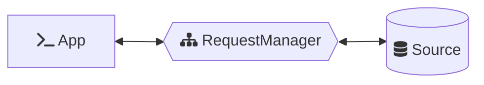
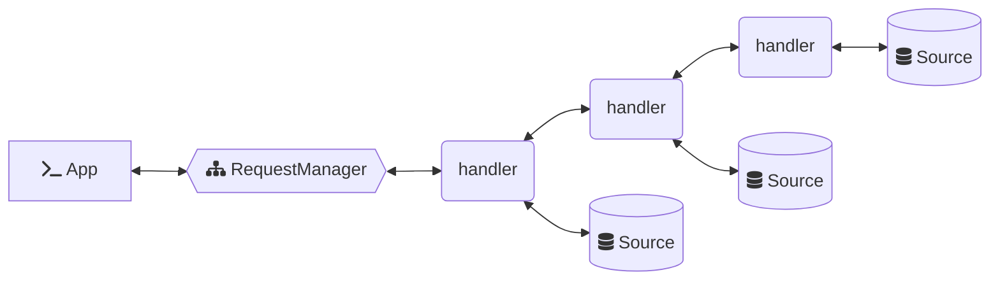
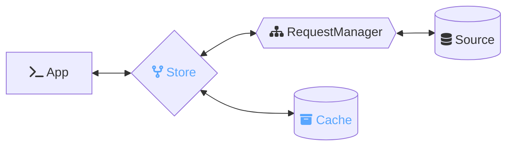
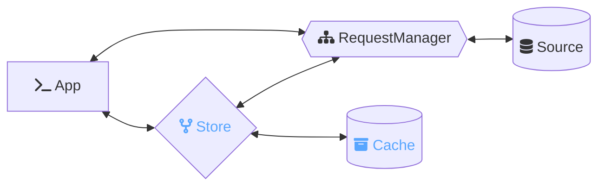

<p align="center">
  
  
</p>

<p align="center">⚡️ a simple abstraction over fetch to enable easy management of request/response flows</p>

This package provides [*Ember***Data**](https://github.com/emberjs/data/)'s `RequestManager`, a framework agnostic library that can be integrated with any Javascript application to make [fetch](https://developer.mozilla.org/en-US/docs/Web/API/Fetch_API) happen.

- [Installation](#installation)
- [Basic Usage](#🚀-basic-usage)
- [Architecture](#🪜-architecture)
- [Usage](#usage)
  - [Making Requests](#making-requests)
    - [Using The Response](#using-the-response)
  - [Request Handlers](#handling-requests)
    - [Handling Errors](#handling-errors)
    - [Handling Abort](#handling-abort)
    - [Stream Currying](#stream-currying)
    - [Automatic Currying](#automatic-currying-of-stream-and-response)
  - [Using as a Service](#using-as-a-service)
    - [Using with `@ember-data/store`](#using-with-ember-datastore)
    - [Using with `ember-data`](#using-with-ember-data)

## Installation

Install using your javascript package manager of choice. For instance with [pnpm](https://pnpm.io/)

```no-highlight
pnpm add @ember-data/request
```

**Tagged Releases**

- 
- 
- 
- 
- 


## 🚀 Basic Usage

A `RequestManager` provides a request/response flow in which configured handlers are successively given the opportunity to handle, modify, or pass-along a request.

The RequestManager on its own does not know how to fulfill requests. For this we must register at least one handler. A basic `Fetch` handler is provided that will take the request options provided and execute `fetch`.

```ts
import RequestManager from '@ember-data/request';
import Fetch from '@ember-data/request/fetch';
import { apiUrl } from './config';

// ... create manager and add our Fetch handler
const manager = new RequestManager();
manager.use([Fetch]);

// ... execute a request
const response = await manager.request({
  url: `${apiUrl}/users`
});
```


## 🪜 Architecture

A `RequestManager` receives a request and manages fulfillment via configured handlers. It may be used standalone from the rest of *Ember***Data** and is not specific to any library or framework.



Each handler may choose to fulfill the request using some source of data or to pass the request along to other handlers.



The same or a separate instance of a `RequestManager` may also be used to fulfill requests issued by [*Ember***Data**{Store}](https://github.com/emberjs/data/tree/main/packages/store)



When the same instance is used by both this allows for simple coordination throughout the application. Requests issued by the Store will use the in-memory cache
and return hydrated responses, requests issued directly to the RequestManager
will skip the in-memory cache and return raw responses.



---

## Usage

```ts
const userList = await manager.request({
  url: `/api/v1/users.list`
});

const users = userList.content;
```

---

### Making Requests

`RequestManager` has a single asyncronous method as it's API: `request`

```ts
class RequestManager {
  request<T>(req: RequestInfo): Future<T>;
}
```

`manager.request(<RequestInfo>)` accepts an object containing the information
necessary for the request to be handled successfully.

These options extend the [options](https://developer.mozilla.org/en-US/docs/Web/API/fetch#parameters) provided to `fetch`, and can accept a [`Request`](https://developer.mozilla.org/en-US/docs/Web/API/Request/Request). All properties accepted by Request options and fetch options are valid.

```ts
interface RequestInfo extends FetchOptions {
  op?: string;
  store?: Store;

  url: string;
  /**
   * data that a handler should convert into 
   * the query (GET) or body (POST)
   */
  data?: Record<string, unknown>;
  /**
   * options specifically intended for handlers
   * to utilize to process the request
   */
  options?: Record<string, unknown>;
}
```

> **note**
> providing a `signal` is unnecessary as an `AbortController` is automatically provided if none is present.

---

#### Using the Response

`manager.request` returns a `Future`, which allows access to limited information about the request while it is still pending and fulfills with the final state when the request completes and the response has been read.

```ts
const usersFuture = manager.request({
  url: `/api/v1/users.list`
});
```

A `Future` is cancellable via `abort`.

```ts
usersFuture.abort();
```

Handlers may *optionally* expose a ReadableStream to the `Future` for streaming data; however, when doing so the handler should not resolve until it has fully read the response stream itself.

```ts
interface Future<T> extends Promise<StructuredDocument<T>> {
  abort(): void;

  async getStream(): ReadableStream | null;
}
```

A Future resolves or rejects with a `StructuredDocument`.

```ts
interface StructuredDocument<T> {
  request: RequestInfo;
  response: ResponseInfo | null;
  content?: T;
  error?: Error;
}
```

The `RequestInfo` specified by `document.request` is the same as originally provided to `manager.request`. If any handler fulfilled this request using different request info it is not represented here. This contract helps to ensure that `retry` and `caching` are possible since the original arguments are correctly preserved. This also allows handlers to "fork" the request or fulfill from multiple sources without the details of fulfillment muddying the original request.

The `ResponseInfo` is a serializable fulfilled subset of a [Response](https://developer.mozilla.org/en-US/docs/Web/API/Response) if set via `setResponse`. If no response was ever set this will be `null`.

```ts
/**
 * All readonly properties available on a Response
 * 
 */
interface ResponseInfo {
  headers?: Record<string, string>;
  ok?: boolean;
  redirected?: boolean;
  status?: HTTPStatusCode;
  statusText?: string;
  type?: 'basic' | 'cors';
  url?: string;
}
```

---

### Request Handlers

Requests are fulfilled by handlers. A handler receives the request context
as well as a `next` function with which to pass along a request to the next
handler if it so chooses.

A handler may be any object with a `request` method. This allows both stateful and non-stateful
handlers to be utilized.

If a handler calls `next`, it receives a `Future` which resolves to a `StructuredDocument`
that it can then compose how it sees fit with its own response.

```ts

type NextFn<P> = (req: RequestInfo) => Future<P>;

interface Handler {
  async request<T>(context: RequestContext, next: NextFn<P>): T;
}
```

`RequestContext` contains a readonly version of the RequestInfo as well as a few methods for building up the `StructuredDocument` and `Future` that will be part of the response.

```ts
interface RequestContext<T> {
  readonly request: RequestInfo;

  setStream(stream: ReadableStream | Promise<ReadableStream>): void;
  setResponse(response: Response | ResponseInfo): void;
}
```

A basic `fetch` handler with support for streaming content updates while
the download is still underway might look like the following, where we use
[`response.clone()`](https://developer.mozilla.org/en-US/docs/Web/API/Response/clone) to `tee` the `ReadableStream` into two streams.

A more efficient handler might read from the response stream, building up the 
response content before passing along the chunk downstream.

```ts
const FetchHandler = {
  async request(context) {
    const response = await fetch(context.request);
    context.setResponse(reponse);
    context.setStream(response.clone().body);

    return response.json();
  }
}
```

Request handlers are registered by configuring the manager via `use`

```ts
manager.use([Handler1, Handler2])
```

Handlers will be invoked in the order they are registered ("fifo", first-in first-out), and may only be registered up until the first request is made. It is recommended but not required to register all handlers at one time in order to ensure explicitly visible handler ordering.

---

#### Handling Errors

Each handler in the chain can catch errors from upstream and choose to
either handle the error, re-throw the error, or throw a new error.

```ts
const MAX_RETRIES = 5;

const Handler = {
  async request(context, next) {
    let attempts = 0;

    while (attempts < MAX_RETRIES) {
      attempts++;
      try {
        const response = await next(context.request);
        return response;
      } catch (e) {
        if (isTimeoutError(e) && attempts < MAX_RETRIES) {
          // retry request
          continue;
        }
        // rethrow if it is not a timeout error
        throw e;
      }
    }
  }
}
```

---

#### Handling Abort
  
Aborting a request will reject the current handler in the chain. However,
every handler can potentially catch this error. If your handler needs to
separate AbortError from other Error types, it is recommended to check
`context.request.signal.aborted` (or if a custom controller was supplied `controller.signal.aborted`).

In this manner it is possible for a request to recover from an abort and
still proceed; however, as a best practice this should be used for necessary
cleanup only and the original AbortError rethrown if the abort signal comes
from the root controller.

**AbortControllers are Always Present and Always Entangled**

If the initial request does not supply an [AbortController](https://developer.mozilla.org/en-US/docs/Web/API/AbortController), one will be generated.

The [signal](https://developer.mozilla.org/en-US/docs/Web/API/AbortSignal) for this controller is automatically added to the request passed into the first handler.

Each handler has the option to supply a new controller to the request when calling `next`. If a new controller is provided it will be automatically
entangled with the root controller. If the root controller aborts, so will
any entangled controllers.

If an entangled controller aborts, the root controller will not abort. This
allows for advanced request-flow scenarios to abort subsections of the request tree without aborting the entire request.

---

#### Stream Currying

`RequestManager.request` and `next` differ from `fetch` in one **crucial detail** in that the outer Promise resolves only once the response stream has been processed.

For context, it helps to understand a few of the use-cases that RequestManager
is intended to allow.

- to manage and return streaming content (such as video files)
- to fulfill a request from multiple sources or by splitting one request into multiple requests
  - for instance one API call for a user and another for the user's friends
  - or e.g. fulfilling part of the request from one source (one API, in-memory, localStorage, IndexedDB
   etc.) and the rest from another source (a different API, a WebWorker, etc.)
- to coalesce multiple requests
- to decorate a request with additional info
    - e.g. an Auth handler that ensures the correct tokens or headers or cookies are attached.

`await fetch(<req>)` resolves at the moment headers are received. This allows for the body of the request to be processed as a stream by application
code *while chunks are still being received by the browser*.

When an app chooses to `await response.json()` what occurs is the browser reads the stream to completion and then returns the result. Additionally, this stream may only be read **once**.

The `RequestManager` preserves this ability to subscribe to and utilize the stream by either the application or the handler – thereby delivering the full power and flexibility of native APIs – without restricting developers in ways that lead to complicated workarounds.

Each handler may call `setStream` only once, but may do so *at any time* until the promise that the handler returns has resolved. The associated promise returned by calling `future.getStream` will resolve with the stream set by `setStream` if that method is called, or `null` if that method
has not been called by the time that the handler's request method has resolved.

Handlers that do not create a stream of their own, but which call `next`, should defensively pipe the stream forward. While this is not required (see automatic currying below) it is better to do so in most cases as otherwise the stream may not become available to downstream handlers or the application until the upstream handler has fully read it.

```ts
context.setStream(future.getStream());
```

Handlers that either call `next` multiple times or otherwise have reason to create multiple  fetch requests should either choose to return no stream, meaningfully combine the streams, or select a single prioritized stream.

Of course, any handler may choose to read and handle the stream, and return either no stream or a different stream in the process.

To conditionally stream, you can check if the user has requested the stream with `context.hasRequestedStream`.

---

#### Automatic Currying of Stream and Response

In order to simplify the common case for handlers which decorate a request, if `next` is called only a single time and `setResponse` was never called by the handler, the response set by the next handler in the chain will be applied to that handler's outcome. For instance, this makes the following pattern possible `return (await next(<req>)).content;`.

Similarly, if `next` is called only a single time and neither `setStream` nor `getStream` was called, we automatically curry the stream from the future returned by `next` onto the future returned by the handler.

Finally, if the return value of a handler is a `Future`, we curry `content` and `errors` as well, thus enabling the simplest form `return next(<req>)`.

In the case of the `Future` being returned, `Stream` proxying is automatic and immediate and does not wait for the `Future` to resolve.

---

### Using as a Service

Most applications will desire to have a single `RequestManager` instance, which can be achieved using module-state patterns for singletons, or for [Ember](https://emberjs.com) applications by exporting the manager as a [service](https://guides.emberjs.com/release/services/).

*services/request.ts*
```ts
import RequestManager from '@ember-data/request';
import Fetch from '@ember-data/request/fetch';
import Auth from 'app/services/auth-handler';

export default class extends RequestManager {
  constructor(createArgs) {
    super(createArgs);
    this.use([Auth, Fetch]);
  }
}
```

---

#### Using with `@ember-data/store`

To have a request service unique to a Store:

```ts
import Store, { CacheHandler } from '@ember-data/store';
import RequestManager from '@ember-data/request';
import Fetch from '@ember-data/request/fetch';

class extends Store {
  requestManager = new RequestManager();

  constructor(args) {
    super(args);
    this.requestManager.use([Fetch]);
    this.requestManager.useCache(CacheHandler);
  }
}
```

---

#### Using with `ember-data`

If using the package [ember-data](https://github.com/emberjs/data/tree/main/packages/-ember-data),
the following configuration will automatically be done in order to preserve the
legacy [Adapter](https://github.com/emberjs/data/tree/main/packages/adapter) and
[Serializer](https://github.com/emberjs/data/tree/main/packages/serializer) behavior.
Additional handlers or a service injection like the above would need to be done by the
consuming application in order to make broader use of `RequestManager`.

```ts
import Store, { CacheHandler } from 'ember-data/store';
import RequestManager from '@ember-data/request';
import Fetch from '@ember-data/request/fetch';
import { LegacyNetworkHandler } from '@ember-data/legacy-compat';

export default class extends Store {
  requestManager = new RequestManager();

  constructor(args) {
    super(args);
    this.requestManager.use([LegacyNetworkHandler, Fetch]);
    this.requestManager.useCache(CacheHandler);
  }
}
```

To provide a different configuration, import and extend `ember-data/store`. The
default configuration will be ignored if the `requestManager` property is set,
though the store will still register the CacheHandler.

For usage of the store's `requestManager` via `store.request(<req>)` see the
[Store](https://api.emberjs.com/ember-data/release/modules/@ember-data%2Fstore) documentation.
