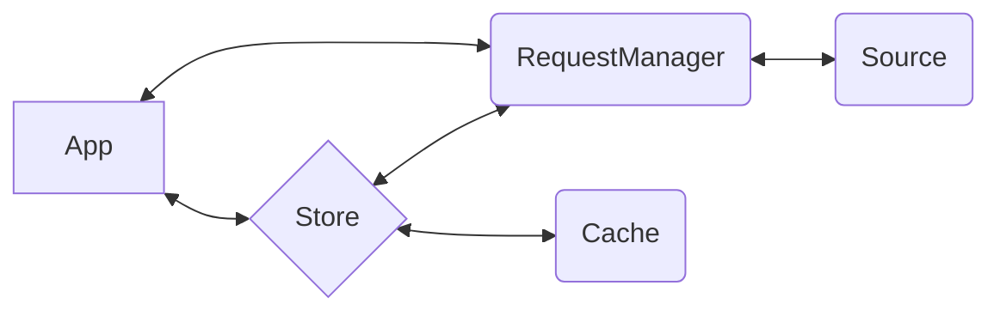

<p align="center">
  
  
</p>

<p align="center">⚡️ a simple abstraction over [fetch](https://developer.mozilla.org/en-US/docs/Web/API/Fetch_API) to enable easy management of request/response flows</p>

This package provides [*Ember***Data**](https://github.com/emberjs/data/)'s `RequestManager`, a standalone library that can be integrated with any Javascript application to make fetch happen.

### How It Fits



## Usage

A `RequestManager` provides a request/response flow in which configured handlers are successively given the opportunity to handle, modify, or pass-along a request.

```ts
interface RequestManager {
  async request<T>(req: RequestInfo): Future<T>;
}
```
