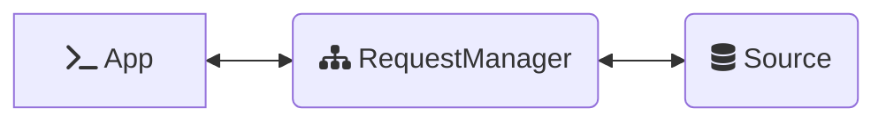
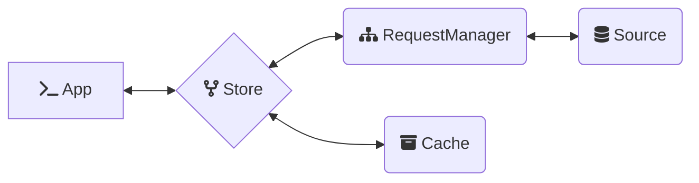
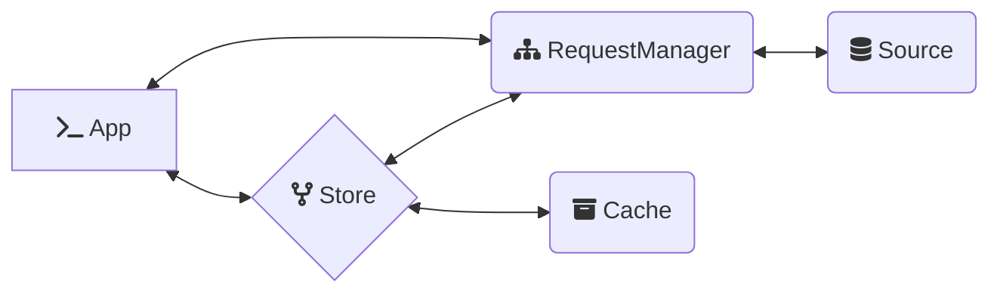

<p align="center">
  
  
</p>

<p align="center">⚡️ a simple abstraction over fetch to enable easy management of request/response flows</p>

This package provides [*Ember***Data**](https://github.com/emberjs/data/)'s `RequestManager`, a standalone library that can be integrated with any Javascript application to make [fetch](https://developer.mozilla.org/en-US/docs/Web/API/Fetch_API) happen.

## Installation

Install using your javascript package manager of choice. For instance with [pnpm](https://pnpm.io/)

```no-highlight
pnpm add @ember-data/request
```

## 🚀 Basic Usage

A `RequestManager` provides a request/response flow in which configured handlers are successively given the opportunity to handle, modify, or pass-along a request.

The RequestManager on its own does not know how to fulfill requests. For this we must register at least one handler. A basic `Fetch` handler is provided that will take the request options provided and execute `fetch`.

```ts
import RequestManager, { Fetch } from '@ember-data/request';
import { apiUrl } from './config';

// ... create manager and add our Fetch handler
const manager = new RequestManager();
manager.use([Fetch]);

// ... execute a request
const response = await manager.request({
  url: `${apiUrl}/users`
});
```


### 🪜 Architecture

A `RequestManager` may be used standalone from the rest of *Ember***Data**.



The same or a separate instance of a `RequestManager` may also be used to fulfill requests issued by [*Ember***Data**{Store}](https://github.com/emberjs/data/tree/master/packages/store)



When the same instance is used by both this allows for simple coordination throughout the application. Requests issued by the Store will use the in-memory cache
and return hydrated responses, requests issued directly to the RequestManager
will skip the in-memory cache and return raw responses.



## Usage

### Making Requests

`RequestManager` has a single asyncronous method as it's API: `request`

```ts
class RequestManager {
  async request<T>(req: RequestInfo): Future<T>;
}
```

`manager.request` accepts a `RequestInfo`, an object containing the information
necessary for the request to be handled successfully.

`RequestInfo` extends the [options](https://developer.mozilla.org/en-US/docs/Web/API/fetch#parameters) provided to `fetch`, and can accept a [`Request`](https://developer.mozilla.org/en-US/docs/Web/API/Request/Request). All properties accepted by Request options and fetch options are valid on `RequestInfo`.

```ts
interface RequestInfo extends FetchOptions {
  url: string;
  /**
   * data that a handler should convert into 
   * the query (GET) or body (POST)
   */
  data?: Record<string, unknown>;
  /**
   * options specifically intended for handlers
   * to utilize to process the request
   */
  options?: Record<string, unknown>;
}
```

> note: providing a `signal` is unnecessary as an `AbortController` is automatically provided if none is present.

`manager.request` returns a `Future`, which allows access to limited information about the request while it is still pending and fulfills with the final state when the request completes.

A `Future` is cancellable via `abort`.

Handlers may optionally expose a ReadableStream to the `Future` for streaming data; however, when doing so the future should not resolve until the response stream is fully read.


## Usage With `@ember-data/store`
