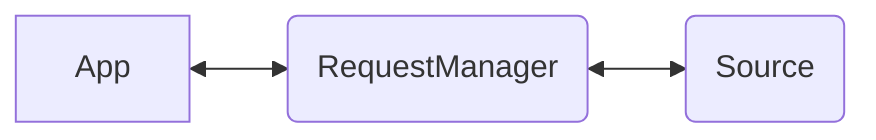

<p align="center">
  
  
</p>

<p align="center">⚡️ a simple abstraction over fetch to enable easy management of request/response flows</p>

This package provides [*Ember***Data**](https://github.com/emberjs/data/)'s `RequestManager`, a standalone library that can be integrated with any Javascript application to make [fetch](https://developer.mozilla.org/en-US/docs/Web/API/Fetch_API) happen.

## Basic Installation

Install using your javascript package manager of choice. For instance with [pnpm](https://pnpm.io/)

```no-highlight
pnpm add -D @ember-data/request
```

## Basic Usage

The RequestManager on its own does not know how to fulfill requests. For this we must register at least one handler. A basic `Fetch` handler is provided that
will take the request options provided and execute `fetch`.

```ts
import RequestManager, { Fetch } from '@ember-data/request';
import { apiUrl } from './config';

// ... create manager and add our Fetch handler
const manager = new RequestManager();
manager.use([Fetch]);

// ... execute a request
const response = await manager.request({
  url: `${apiUrl}/users`
});
```


### How It Fits

A `RequestManager` may be used standalone from the rest of *Ember***Data**.



The same or a separate `RequestManager` may also be used to fulfill requests issued by [*Ember***Data**{Store}](https://github.com/emberjs/data/tree/master/packages/store)


When the same instance is used by both this allows for simple coordination throughout the application. Requests issued by the Store will use the in-memory cache
and return hydrated responses, requests issued directly to the RequestManager
will skip the in-memory cache and return raw responses.


## Usage

A `RequestManager` provides a request/response flow in which configured handlers are successively given the opportunity to handle, modify, or pass-along a request.

```ts
interface RequestManager {
  async request<T>(req: RequestInfo): Future<T>;
}
```
