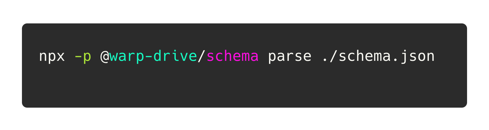

<p align="center">
  
  
</p>

<h3 align="center">:electron: Declarative Schema Parser</h3>
<p align="center">Build faster with better DX</p>

<p align="center">
    
</p>

`@warp-drive/schema` allows you to easily use the typescript you already know as a statically analyzable schema language.

Its like GraphQL, RPC, or Protobuf... but for anything!

## Usage

> ⚠️ Private

This package may currently only be used within EmberData. A public version is coming soon 💜

#### 🔜 Soon 

Scaffold the schema for a `User` resource

```no-highlight
npx -p @warp-drive-schema resource user
```

Parse Schemas

```no-highlight
npx -p @warp-drive/schema parse <path/to/schema.json>
```

## How it works

The parser expects a json config file.

```ts
{
  "schemas": "./src/schemas",
  "dest": "./dist",
}
```

### ♥️ Credits

 <details>
   <summary>Brought to you with ♥️ love by <a href="https://emberjs.com" title="EmberJS">🐹 Ember</a></summary>

  <style type="text/css">
    img.project-logo {
       padding: 0 5em 1em 5em;
       width: 100px;
       border-bottom: 2px solid #0969da;
       margin: 0 auto;
       display: block;
     }
    details > summary {
      font-size: 1.1rem;
      line-height: 1rem;
      margin-bottom: 1rem;
    }
    details {
      font-size: 1rem;
    }
    details > summary strong {
      display: inline-block;
      padding: .2rem 0;
      color: #000;
      border-bottom: 3px solid #0969da;
    }

    details > details {
      margin-left: 2rem;
    }
    details > details > summary {
      font-size: 1rem;
      line-height: 1rem;
      margin-bottom: 1rem;
    }
    details > details > summary strong {
      display: inline-block;
      padding: .2rem 0;
      color: #555;
      border-bottom: 2px solid #555;
    }
    details > details {
      font-size: .85rem;
    }

    @media (prefers-color-scheme: dark) {
      details > summary strong {
        color: #fff;
      }
    }
    @media (prefers-color-scheme: dark) {
      details > details > summary strong {
        color: #afaba0;
      border-bottom: 2px solid #afaba0;
      }
    }
  </style>
</details>
