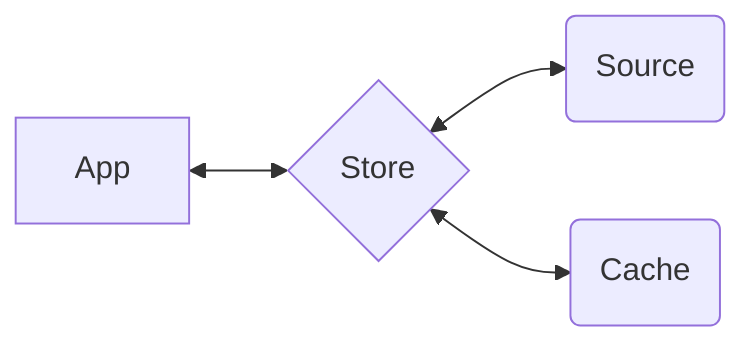

<p align="center">
  
  
</p>

<p align="center">⚡️ The lightweight reactive data library for JavaScript applications</p>

This package provides [\*Ember**\*Data**](https://github.com/emberjs/data/)'s `Store` class.

The `Store` coordinates interaction between your application, the `Cache`, and sources of data (such as your `API` or a local persistence layer).



## Installation

Install using your javascript package manager of choice. For instance with [pnpm](https://pnpm.io/)

```js
import Store from '@ember-data/store';
import Cache from '@ember-data/record-data';

class extends Store {
  #cache = null;

  createRecordDataFor(identifier, storeWrapper) {
    this.#cache = this.#cache || new Cache(storeWrapper);
    this.#cache.createCache(identifier);
    return this.#cache;
  }
}
```

pnpm add @ember-data/store

````

After installing you will want to configure your first `Store`. Read more below for how to create and configure stores for your application.


## 🛠 Creating A Store

To use a `Store` we will need to do few things: add a `Cache` to store data **in-memory**, add an `Adapter` to fetch data from a source, and implement `instantiateRecord` to tell the store how to display the data for individual resources.

> **Note** If you are using the package `ember-data` then a `JSON:API` cache and `instantiateRecord` are configured for you by default.

### Configuring A Cache

To start, let's install a `JSON:API` cache. If your app uses `GraphQL` or `REST` other caches may better fit your data. You can author your own cache by creating one that conforms to the [spec]().

The package `@ember-data/record-data` provides a `JSON:API` cache we can use. After installing it, we can configure the store to use this cache.

```js
import Store from '@ember-data/store';
import Cache from '@ember-data/record-data';

class extends Store {
  #cache = null;

  createRecordDataFor(identifier, storeWrapper) {
    this.#cache = this.#cache || new Cache(storeWrapper);
    this.#cache.createCache(identifier);
    return this.#cache;
  }
}
````

Now that we have a `cache` let's setup something to handle fetching and saving data via our API.

### Adding An Adapter

To start, let's install a `JSON:API` adapter. If your app uses `GraphQL` or `REST` other adapters may better fit your data. You can author your own adapter by creating one that conforms to the [spec]().

The package `@ember-data/adapter` provides a `JSON:API` adapter we can use. After installing it, we can configure the store to use this adapter.

```js
import Store from '@ember-data/store';
import Adapter from '@ember-data/adapter/json-api';

class extends Store {
  #adapter = new Adapter();

  adapterFor() {
    return this.#adapter;
  }
}
```

#### Using with Ember

Note: If you are using Ember and would like to make use of `service` injections in your adapter, you will want to additionally `setOwner` for the Adapter.

```js
import Store from '@ember-data/store';
import Adapter from '@ember-data/adapter/json-api';
import { getOwner, setOwner } from '@ember/application';

class extends Store {
  #adapter = null;

  adapterFor() {
    let adapter = thsi.#adapter;
    if (!adapter) {
      const owner = getOwner(this);
      adapter = new Adapter();
      setOwner(adapter, owner);
      this.#adapter = adapter;
    }

    return adapter;
  }
}
```

By default when using with Ember you only need to implement this hook if you want your adapter usage to be statically analyzeable. \*Ember**\*Data** will attempt to resolve adapters using Ember's resolver.
