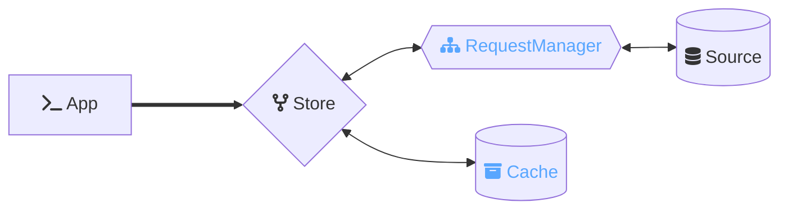
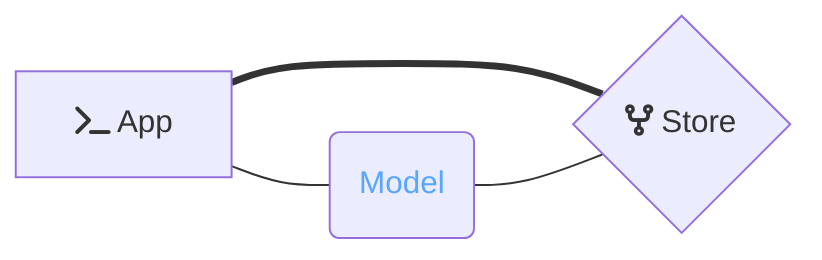

<p align="center">
  
  
</p>

<p align="center">⚡️ The lightweight reactive data library for JavaScript applications</p>

This package provides [*Ember***Data**](https://github.com/emberjs/data/)'s `Store` class.

The `Store` coordinates interaction between your application, a [Cache](https://api.emberjs.com/ember-data/release/classes/%3CInterface%3E%20Cache),
and sources of data (such as your API or a local persistence layer) accessed via a [RequestManager](https://github.com/emberjs/data/tree/main/packages/request).



Optionally, the Store can be configured to hydrate the response data into rich presentation classes.



## Installation

Install using your javascript package manager of choice. For instance with [pnpm](https://pnpm.io/)

```
pnpm add @ember-data/store
```

After installing you will want to configure your first `Store`. Read more below for how to create and configure stores for your application.

**Tagged Releases**

- 
- 
- 
- 
- 


## 🔨 Creating A Store

To use a `Store` we will need to do few things: add a [Cache](https://api.emberjs.com/ember-data/release/classes/%3CInterface%3E%20Cache) to store data **in-memory**, add a [Handler](https://github.com/emberjs/data/tree/main/packages/request#handling-requests) to fetch data from a source, and implement `instantiateRecord` to tell the store how to display the data for individual resources. 

> **Note**
> If you are using the package `ember-data` then a `JSON:API` cache and `instantiateRecord` are configured for you by default.

### Configuring A Cache

To start, let's install a [JSON:API](https://jsonapi.org/) cache. If your app uses `GraphQL` or `REST` other caches may better fit your data. You can author your own cache by creating one that conforms to the [spec](https://api.emberjs.com/ember-data/release/classes/%3CInterface%3E%20Cache).

The package [@ember-data/json-api](https://github.com/emberjs/data/tree/main/packages/json-api) provides a [JSON:API](https://jsonapi.org/) cache we can use. After installing it, we can configure the store to use this cache.

```js
import Store from '@ember-data/store';
import Cache from '@ember-data/json-api';

class extends Store {
  createCache(storeWrapper) {
    return new Cache(storeWrapper);
  }
}
```

Now that we have a `cache` let's setup something to handle fetching and saving data via our API.

> **Note**
> The `ember-data` package automatically includes and configures the `@ember-data/json-api` cache for you.

### Handling Requests

When *Ember***Data** needs to fetch or save data it will pass that request to your application's `RequestManager` for fulfillment. How this fulfillment occurs (in-memory, device storage, via single or multiple API requests, etc.) is then up to the registered request handlers.

To start, let's install the `RequestManager` from `@ember-data/request` and the basic `Fetch` handler from ``@ember-data/request/fetch`.

> **Note**
> If your app uses `GraphQL`, `REST` or different conventions for `JSON:API` than your cache expects, other handlers may better fit your data. You can author your own handler by creating one that conforms to the [handler interface](https://github.com/emberjs/data/tree/main/packages/request#handling-requests).

```ts
import Store, { CacheHandler } from '@ember-data/store';
import RequestManager from '@ember-data/request';
import Fetch from '@ember-data/request/fetch';

export default class extends Store {
  requestManager = new RequestManager()
    .use([Fetch])
    .useCache(CacheHandler);
}
```

**Using RequestManager as a Service**

Alternatively if you have configured the `RequestManager` to be a service you may re-use it.

*app/services/request.js*
```ts
import RequestManager from '@ember-data/request';
import { CacheHandler } from '@ember-data/store';
import Fetch from '@ember-data/request/fetch';

export default class extends RequestManager {
  constructor(createArgs) {
    super(createArgs);
    this.use([Fetch]);
    this.useCache(CacheHandler);
  }
}
```

*app/services/store.js*
```ts
import Store from '@ember-data/store';
import { service } from '@ember/service';

export default class extends Store {
  @service('request') requestManager
}
```

### Presenting Data from the Cache

Now that we have a source and a cach for our data, we need to configure how the Store delivers that data back to our application. We do this via the hook [instantiateRecord](https://api.emberjs.com/ember-data/release/classes/Store/methods/instantiateRecord%20(hook)?anchor=instantiateRecord%20(hook)),
which allows us to transform the data for a resource before handing it to the application.

A naive way to present the data would be to return it as JSON. Typically instead this hook will be used to add reactivity and make each unique resource a singleton, ensuring that if the cache updates our presented data will reflect the new state.

Below is an example of using the hooks `instantiateRecord` and a `teardownRecord` to provide minimal read-only reactive state for simple resources.

```ts
import Store, { recordIdentifierFor } from '@ember-data/store';
import { TrackedObject } from 'tracked-built-ins';

class extends Store {
  instantiateRecord(identifier) {
    const { cache, notifications } = this;

    // create a TrackedObject with our attributes, id and type
    const record = new TrackedObject(Object.assign({}, cache.peek(identifier)));
    record.type = identifier.type;
    record.id = identifier.id;
    
    // update the TrackedObject whenever attributes change
    const token = notifications.subscribe(identifier, (_, change) => {
      if (change === 'attributes') {
        Object.assign(record, cache.peek(identifier));
      }
    });

    record.destroy = () => {
      this.notifications.unsubscribe(token);
    };

    return record;
  }

  teardownRecord(record: FakeRecord) {
    record.destroy();
  }
}
```

Because `instantiateRecord` is opaque to the nature of the record, an implementation can be anything from a fairly simple object to a robust proxy that intelligently links together associated records through relationships.

This also enables creating a record that separates `edit` flows from `create` flows entirely. A record class might choose to implement a `checkout` method that gives access to an editable instance while the primary record continues to be read-only and reflect only persisted (non-mutated) state.

Typically you will choose an existing record implementation such as `@ember-data/model` for your application.

Because of the boundaries around instantiation and the cache, record implementations should be capable of interop both with each other and with any `Cache`. Due to this, if needed an application can utilize multiple record implementations and multiple cache implementations either to support enhanced features for only a subset of records or to be able to incrementally migrate from one record/cache to another record or cache.

> **Note**
> The `ember-data` package automatically includes the `@ember-data/model`
> package and configures it for you.
