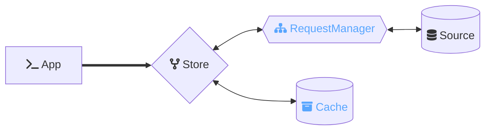
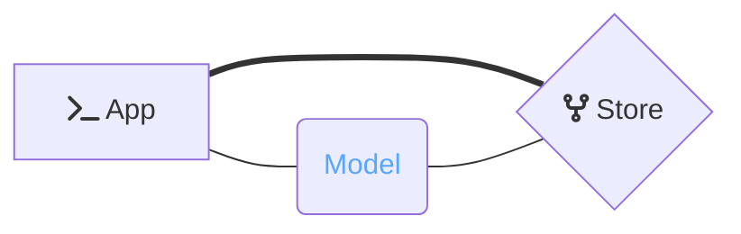

<p align="center">
  
  
</p>

<p align="center">⚡️ The lightweight reactive data library for JavaScript applications</p>

This package provides [*Ember***Data**](https://github.com/emberjs/data/)'s `Store` class.

The `Store` coordinates interaction between your application, the `Cache`, and sources of data (such as your `API` or a local persistence layer).



Optionally, the Store can be configured to hydrate the response data into rich presentation classes.



## Installation

Install using your javascript package manager of choice. For instance with [pnpm](https://pnpm.io/)

```
pnpm add @ember-data/store
```

After installing you will want to configure your first `Store`. Read more below for how to create and configure stores for your application.


## 🔨 Creating A Store

To use a `Store` we will need to do few things: add a `Cache` to store data **in-memory**, add an `Adapter` to fetch data from a source, and implement `instantiateRecord` to tell the store how to display the data for individual resources. 

> **Note** If you are using the package `ember-data` then a `JSON:API` cache and `instantiateRecord` are configured for you by default.

### Configuring A Cache

To start, let's install a `JSON:API` cache. If your app uses `GraphQL` or `REST` other caches may better fit your data. You can author your own cache by creating one that conforms to the [spec]().

The package `@ember-data/json-api` provides a `JSON:API` cache we can use. After installing it, we can configure the store to use this cache.

```js
import Store from '@ember-data/store';
import { Cache } from '@ember-data/json-api';

class extends Store {
  createCache(storeWrapper) {
    return new Cache(storeWrapper);
  }
}
```

Now that we have a `cache` let's setup something to handle fetching and saving data via our API.

> Note: [1] the cache from `@ember-data/json-api` is a special cache: if the package is present the `createCache` hook will automatically do the above wiring if the hook is not implemented. We still recommend implementing the hook.
>
> Note: [2] The `ember-data` package automatically includes the `@ember-data/json-api` cache for you.

### Adding An Adapter

When *Ember***Data** needs to fetch or save data it will pass that request to your application's `Adapter` for fulfillment. How this fulfillment occurs (in-memory, device storage, via single or multiple API requests, etc.) is up to that Adapter.

To start, let's install a `JSON:API` adapter. If your app uses `GraphQL` or `REST` other adapters may better fit your data. You can author your own adapter by creating one that conforms to the [spec]().

The package `@ember-data/adapter` provides a `JSON:API` adapter we can use. After installing it, we can configure the store to use this adapter.

```js
import Store from '@ember-data/store';
import Adapter from '@ember-data/adapter/json-api';

class extends Store {
  #adapter = new Adapter();

  adapterFor() {
    return this.#adapter;
  }
}
```

If you want to know more about using Adapters with Ember read the next section, else lets skip to [Presenting Data from the Cache](#presenting-data-from-the-cache) to configure how our application will interact with our data. 

#### Using with Ember

Note: If you are using Ember and would like to make use of `service` injections in your adapter, you will want to additionally `setOwner` for the Adapter.

```js
import Store from '@ember-data/store';
import Adapter from '@ember-data/adapter/json-api';
import { getOwner, setOwner } from '@ember/application';

class extends Store {
  #adapter = null;

  adapterFor() {
    let adapter = thsi.#adapter;
    if (!adapter) {
      const owner = getOwner(this);
      adapter = new Adapter();
      setOwner(adapter, owner);
      this.#adapter = adapter;
    }

    return adapter;
  }
}
```

By default when using with Ember you only need to implement this hook if you want your adapter usage to be statically analyzeable. *Ember***Data** will attempt to resolve adapters using Ember's resolver. To provide a single Adapter for your application like the above you would provide it as the default export of the file `app/adapters/application.{js/ts}`

### Presenting Data from the Cache

Now that we have a source and a cach for our data, we need to configure how the Store delivers that data back to our application. We do this via the hook `instantiateRecord`, which allows us to transform the data for a resource before handing it to the application.

A naive way to present the data would be to return it as JSON. Typically instead this hook will be used to add reactivity and make each uniue resource a singleton, ensuring that if the cache updates our presented data will reflect the new state.

Below is an example of using the hooks `instantiateRecord` and a `teardownRecord` to provide minimal read-only reactive state for simple resources.

```ts
import Store, { recordIdentifierFor } from '@ember-data/store';
import { TrackedObject } from 'tracked-built-ins';

class extends Store {
  instantiateRecord(identifier) {
    const { cache, notifications } = this;

    // create a TrackedObject with our attributes, id and type
    const record = new TrackedObject(Object.assign({}, cache.peek(identifier)));
    record.type = identifier.type;
    record.id = identifier.id;
    
    notifications.subscribe(identifier, (_, change) => {
      if (change === 'attributes') {
        Object.assign(record, cache.peek(identifier));
      }
    });

    return record;
  }
}
```

Because `instantiateRecord` is opaque to the nature of the record, an implementation can be anything from a fairly simple object to a robust proxy that intelligently links together associated records through relationships.

This also enables creating a record that separates `edit` flows from `create` flows entirely. A record class might choose to implement a `checkout`method that gives access to an editable instance while the primary record continues to be read-only and reflect only persisted (non-mutated) state.

Typically you will choose an existing record implementation such as `@ember-data/model` for your application.

Because of the boundaries around instantiation and the cache, record implementations should be capable of interop both with each other and with any `Cache`. Due to this, if needed an application can utilize multiple record implementations and multiple cache implementations either to support enhanced features for only a subset of records or to be able to incrementally migrate from one record/cache to another record or cache.

> Note: [1] `@ember-data/model` is a special record implementation: if the package is present the `instantiateRecord` hook will automatically do the above wiring if the hook is not implemented. Due to the complexity of this legacy package's use of Ember's resolver, we do not recommend wiring this package manually.
>
> Note: [2] The `ember-data` package automatically includes the `@ember-data/model` implementation for you.
